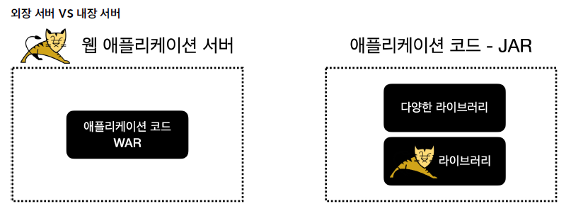
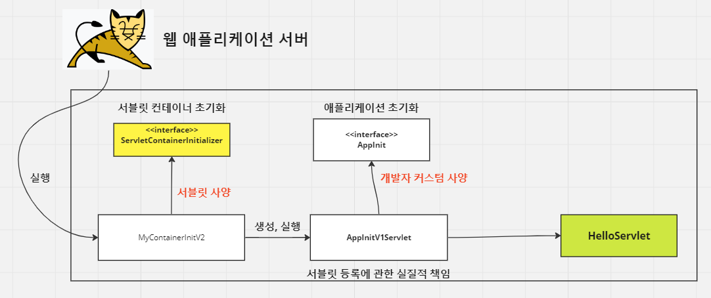
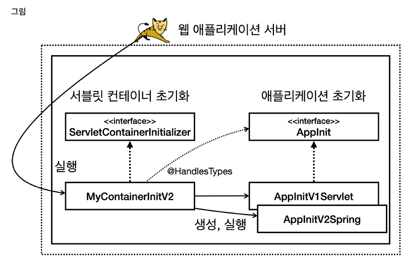
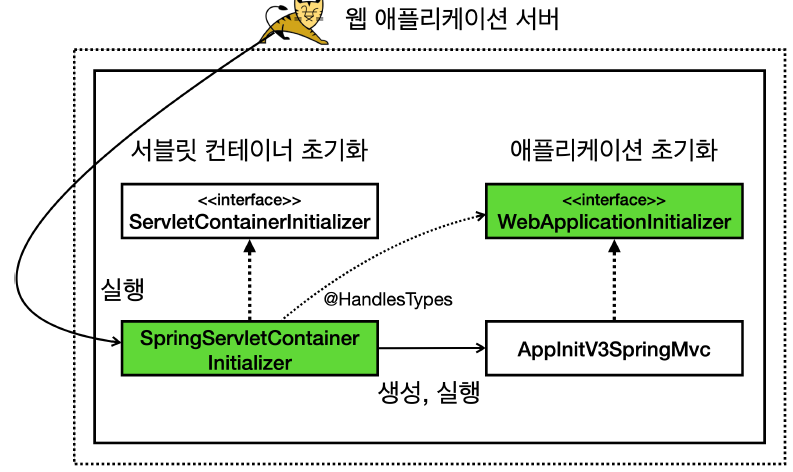

<nav>
    <a href="../.." target="_blank">[Spring Boot]</a>
</nav>


# 2.10 정리

---

## 1. 웹 서버와 스프링 부트


- 옛날 방식
  - 외장 서버 : 서블릿 기반으로 애플리케이션을 개발하고 WAR를 빌드한 뒤 외장서버(톰캣 서버)에 올리기
  - 서블릿 컨테이너도 설정하고, 스프링 컨테이너도 만들어서 등록하고, 디스패처 서블릿을 만들어서 스프링 MVC와 연결하는 작업을 수행해야 함
- 최근 스프링부트 방식
  - JAR 파일을 JVM 위에서 실행하면 웹 서버가 구동됨
  - 라이브러리에 WAS가 내장됨
  - 그냥 컨트롤러만 작성해서 스프링 빈으로 등록해주면 디스패처 서블릿을 통해 컨트롤러로 요청을 포워딩해주므로 편리하게 웹 서버를 개발할 수 있음
- 옛날 방식을 공부하는 이유
  - 최근 개발자들은 옛날 방식을 경험할 일이 없다.
  - 과거에 어떻게 했는지 알아야 현재의 방식이 왜 이렇게 사용되고 있는지 더 깊이있는 이해가 가능

---

## 2. 톰캣 설치 및 사용법
- 직접 톰캣 서버를 설치
- 최근에는 docker hub에 톰캣 이미지가 올려져 있으므로 컨테이너 단위로 톰캣 서버를 배포하는 것도 가능

---

## 3. 프로젝트 설정
```kotlin
    plugins {
        kotlin("jvm") version "1.9.23"
        id("war")
    }
```
```kotlin
        implementation("jakarta.servlet:jakarta.servlet-api:6.0.0")
```
- gradle 기준 'war' 플러그인을 등록해두면 빌드 시 war로 빌드됨
- gradle 기준 'jakarta.servlet:jakarta.servlet-api' 라이브러리를 의존성으로 등록하면 서블릿 API를 사용 가능

---

## 4. WAR 빌드와 배포
- 빌드
  - `./gradlew build`
  - `build/libs/` 아래에 war 파일이 빌드됨
    - WAR 내부 구조
      - `/WEB-INF` 하위 : 자바 클래스와 라이브러리, 그리고 설정 정보가 들어가는 곳
      - 그 외 : HTML, CSS 같은 정적 리소스가 사용되는 영역
- 배포
  - WAR 파일을 톰캣 경로의 webapps 아래에 올리면 됨.
  - 이름에 주의할 것.
    - ROOT.war 이름으로 등록 -> 루트 아래에 배포
    - 그 외 이름으로 등록 -> 해당 이름 경로 아래에 배포 (예: hello.war의 index.html -> `/hello/index.html`)

---

## 5. IDE를 이용하여 편리하게 외장 서버 기반 애플리케이션 개발하기
- 우리가 개발한 서블릿, html 파일은 결국 톰캣 서버 위에서 실행되어야한다.
- 로컬 환경 개발 과정에서 이들을 수동으로 로컬 톰캣에 올리는 과정을 수행해야하는 불편함이 있다.
- 인텔리제이, 이클립스와 같은 IDE는 로컬 톰캣에 올리고 실행하는 과정을 간소화시켜주므로 적극적으로 사용하자

---

## 6. 서블릿 직접 올리는 방식
```kotlin
@WebServlet(urlPatterns = ["/test"])
class TestServlet : HttpServlet() {

    override fun service(req: HttpServletRequest, resp: HttpServletResponse) {
        println("TestServlet.service")
        resp.writer.println("test")
    }
}
```
- `@WebServlet` 어노테이션을 달아서 어느 경로로 매핑할 지 지정하는 방식
- HttpServlet() 를 상속해야 함
- 장점 : 빠르게 서블릿을 등록하는 것이 가능
- 단점
  - 서블릿 코드에 경로를 지정하는 코드를 하드코딩해서 같이 넣어줘야 하므로 유연하지 못 함

## 7. 서블릿 컨테이너 초기화 방식
```text
hello.container.MyContainerInitV1
```
- `resources/META-INF/services/jakarta.servlet.ServletContainerInitializer` 파일 생성
- 서블릿 컨테이너 초기화 클래스(ServletContainerInitializer)를 WAS에게 알림

```kotlin
class MyContainerInitV1 : ServletContainerInitializer {

    override fun onStartup(classes: MutableSet<Class<*>>?, context: ServletContext?) {
        println("MyContainerInitV1.onStartUp")
        println("MyContainerInitV1 classes = $classes")
        println("MyContainerInitV context = $context")
    }
}
```
- 이 클래스에서 서블릿 컨테이너 초기화 과정에서 수행할 작업을 넣어주면 됨
- 서블릿을 직접 여기서 등록하는 것도 가능

## 8. 애플리케이션 초기화 방식


1. 서블릿 컨테이너 초기화 실행
    - resources/META-INF/services/jakarta.servlet.ServletContainerInitializer 설정에 등록된 ServletContainerInitializer들 실행
2. 애플리케이션 초기화 실행
    - `@HandleTypes(AppInit.class)`
    - 지정한 인터페이스의 구현체 클래스를 가져와서 각 클래스의 인스턴스를 생성하고 실행하는 것이 가능

---

## 9. 애플리케이션 초기화 방식 + 스프링 컨테이너 연동


- AppInitV2Spring 클래스에서 스프링 컨테이너를 생성하고, 디스패처 서블릿을 생성
- 서블릿 컨테이너에 디스패처 서블릿을 등록
- 개발자는 스프링 컨트롤러를 빈으로 등록하기만 하면 요청을 컨트롤러로 포워딩 시킬 수 있게 됨

---

## 10. 스프링 MVC와 서블릿 컨테이너 초기화 방식


```text
org.springframework.web.SpringServletContainerInitializer
```
- spring web 라이브러리는 `/META-INF/services/jakarta.servlet.ServletContainerInitializer` 파일에 위 서블릿 컨테이너 초기화자를 등록해둠
- 이 클래스는 `@HandlesTypes(WebApplicationInitializer.class)` 어노테이션이 달려있음.

```kotlin
package hello.container

import hello.spring.HelloConfig
import jakarta.servlet.ServletContext
import jakarta.servlet.ServletRegistration
import org.springframework.web.WebApplicationInitializer
import org.springframework.web.context.support.AnnotationConfigWebApplicationContext
import org.springframework.web.servlet.DispatcherServlet


/**
 * http://localhost:8080/hello-spring
 */
class AppInitV3SpringMvc : WebApplicationInitializer {
    override fun onStartup(servletContext: ServletContext) {
        println("AppInitV3SpringMvc.onStartup")

        // 스프링 컨테이너 생성
        val appContext = AnnotationConfigWebApplicationContext()
        appContext.register(HelloConfig::class.java)

        // 스프링 MVC 디스페처 서블릿 생성, 스프링 컨테이너 연결
        val dispatcherServlet = DispatcherServlet(appContext)

        // 디스페처 서블릿을 서블릿 컨테이너에 등록 (이름 주의! dispatcherV3)
        val servletRegistration: ServletRegistration.Dynamic = servletContext.addServlet("dispatcherV3", dispatcherServlet)

        // 모든 요청이 디스페처 서블릿을 통하도록 설정
        servletRegistration.addMapping("/")
    }
}
```
- 따라서 우리는 해당 인터페이스 구현체를 기반으로 애플리케이션 초기화를 해주기만 하면 됨

---

## 11. 더 나아가기
- 지금까지 알아본 내용은 모두 서블릿 컨테이너 위에서 동작하는 방법이다. 따라서 항상 톰캣 같은 서블릿 컨테이너에 배
포를 해야만 동작하는 방식이다.
- 과거에는 서블릿 컨테이너 위에서 모든 것이 동작했지만, 스프링 부트와 내장 톰캣을 사용하면서 이런 부분이 바뀌기 시
작했다.

---
