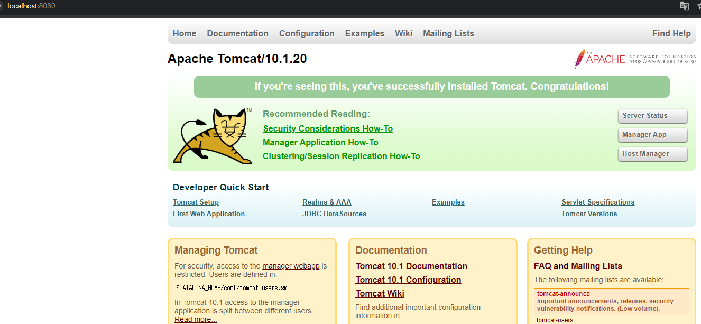

<nav>
    <a href="../.." target="_blank">[Spring Boot]</a>
</nav>

# 2.2 톰캣 설치

---

## 1. 다운로드
- https://tomcat.apache.org/download-10.cgi
- Download 메뉴에서 Apache Tomcat 10 버전의 톰캣 다운로드
  - Core에 있는 zip 을 선택
- 다운로드 후 압축 풀기(예: `/tools/...`)

---

## 2. 톰캣 실행
### 2.1 리눅스/ macOS
- tomcat 이 설치된 경로의 `bin` 경로로 이동
  - MAC, 리눅스 사용자는 권한을 주지 않으면 permission denied 라는 오류가 발생할 수 있다.
- 권한설정 : `chmod 755 *`
- 실행: `./startup.sh`
- 종료: `./shutdown.sh`

### 2.2 윈도우
- 톰캣폴더/bin 폴더로 이동
- 실행: `startup.bat`
- 종료: `shutdown.bat`

### 2.3 실행 확인


- 톰캣을 실행한 상태로 `http://localhost:8080`에 접근하면 톰캣 서버가 실행된 화면을 확인할 수 있다.
- 참고로 톰캣의 실행 로그는 `톰캣폴더/logs/catalina.out` 파일로 확인할 수 있다.

### 2.4 톰캣이 잘 실행되지 않았을 때

- 톰캣을 실행했지만 [http://localhost:8080](http://localhost:8080/) 에 접근이 되지 않으면 우선 실행 로그를 확인해야 한다.
  - `실행 로그 톰캣폴더/logs/catalina.out`
- 만약 다음과 같은 메시지가 보인다면 어떤 프로그램이 이미 8080 포트를 사용하고 있는 것이다.
  - `java.net.BindException: Address already in use`

#### 2.4.1 해결방안 1 - 해당 포트를 사용하는 프로세스를 종료
8080 포트를 사용하는 프로세스를 찾아 종료한다. 종료가 어렵다면, 컴퓨터를 재부팅하는 것도 방법이다.
- macOS
  - `sudo lsof -i :8080` 프로세스 ID(PID) 조회
  - `sudo kill -9 PID` : 프로세스 종료
- window
  - cmd를 열고 아래 명령어 순차적으로 실행
  - 현재 포트를 사용중인 프로세스 찾기
  - 프로세스 강제 종료하기
  - **taskkill /f /pid 프로세스번호**

#### 2.4.2 해결방안 2 - 톰캣 서버 포트 변경
- 아래에서 후술한다.

---

# 3. 톰캣 서버 포트 변경
```xml
<Connector port="8080" protocol="HTTP/1.1"
					 connectionTimeout="20000"
					 redirectPort="8443" />
```

- 톰캣 설정 파일을 수정한다.(`톰캣 폴더/conf/server.xml`)
  - 여기에 보면 8080 이라는 부분이 있는데, 이 부분을 다른 포트로 변경한다.
  - 그리고 톰캣 서버를 종료하고 다시 시작한 다음 다른 포트로 접근한다.
    예) 9080 포트로 변경했으면 `http://localhost:9080` 으로 접근한다.

---
