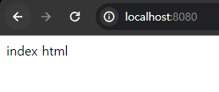

<nav>
    <a href="../.." target="_blank">[Spring Boot]</a>
</nav>

# 2.4 WAR 빌드와 배포
WAS에 우리가 만든 코드를 빌드하고 배포해보자.

---

## 1. 프로젝트 WAR 빌드

### 1.1 WAR 빌드
```shell
$ ./gradlew clean build
$ cd build/libs

$ ls -al
total 1892
drwxr-xr-x 1 ttasjwi 197121       0  4월 17 15:40 ./
drwxr-xr-x 1 ttasjwi 197121       0  4월 17 15:40 ../
-rw-r--r-- 1 ttasjwi 197121 1933753  4월 17 15:40 server-0.0.1-SNAPSHOT.war

```
- 프로젝트 폴더로 이동
- 프로젝트 빌드
    - `./gradlew build`
    - [윈도우 OS]: gradlew build
- WAR 파일 생성 확인
  `build/libs/server-0.0.1-SNAPSHOT.war`
- 참고
    ```java
    plugins {
        id 'java'
        id 'war'
    }
    ```
    - 우리가 build.gradle의 plugins 에서 설정해준 ‘war’ 플러그인이 war 파일을 만들어준다.

### 1.2 WAR 압축 풀기
```shell
$ jar -xvf server-0.0.1-SNAPSHOT.war 
```
- build/libs 폴더로 들어가서 위 명령어를 입력하면 war 파일 압축이 해제된다.

### 1.3 WAR 압축 푼 결과
WAR를 푼 결과
- WEB-INF
    - classes
        - hello/servlet/TestServlet.class
    - lib
        - jakarta.servlet-api-6.0.0.jar
- index.html

WAR를 푼 결과를 보면 WEB-INF , classes , lib 같은 특별한 폴더들이 보인다. 이 부분을 알아보자.

---

## 2. JAR vs WAR
### 2.1 JAR 소개
- 자바는 여러 클래스와 리소스를 묶어서 JAR (Java Archive)라고 하는 압축 파일을 만들 수 있다.
- 이 파일은 JVM 위에서 직접 실행되거나 또는 다른 곳에서 사용하는 라이브러리로 제공된다.
- 직접 실행하는 경우 `main()` 메서드가 필요하고, `MANIFEST.MF` 파일에 실행할 메인 메서드가 있는
  클래스를 지정해두어야 한다.
- 실행 예) `java -jar abc.jar`
- Jar는 쉽게 이야기해서 클래스와 관련 리소스를 압축한 단순한 파일이다. 필요한 경우 이 파일을 직접
  실행할 수도 있고, 다른 곳에서 라이브러리로 사용할 수도 있다.

### 2.2 WAR 소개
- WAR(Web Application Archive)라는 이름에서 알 수 있듯 WAR 파일은 웹 애플리케이션 서버(WAS)
  에 배포할 때 사용하는 파일이다.
- JAR 파일이 JVM 위에서 실행된다면, **WAR는 웹 애플리케이션 서버 위에서 실행된다.**
- 웹 애플리케이션 서버 위에서 실행되고, HTML 같은 정적 리소스와 클래스 파일을 모두 함께 포함하기 때문에 JAR와 비교해서 구조가 더 복잡하다. 그리고 WAR 구조를 지켜야 한다.

### 2.3 WAR 구조
- `WEB-INF`
    - classes : 실행 클래스 모음
    - lib : 라이브러리 모음
    - web.xml : 웹 서버 배치 설정 파일(생략 가능)
- `index.html` : 정적 리소스
- `WEB-INF` 폴더 하위는 자바 클래스와 라이브러리, 그리고 설정 정보가 들어가는 곳이다.
- `WEB-INF` 를 제외한 나머지 영역은 HTML, CSS 같은 정적 리소스가 사용되는 영역이다.

---

## 3. WAR 배포
1. 톰캣 서버를 종료한다. `./shutdown.sh`
2. `톰캣폴더/webapps` 하위를 모두 삭제한다.
    ```bash
    cd 톰캣하위폴더/webapps
    rm -rf ./*
    ```
3. 빌드된 `server-0.0.1-SNAPSHOT.war` 를 복사하여 `톰캣폴더/webapps` 하위에 붙여넣는다.
    ```bash
    cp server-0.0.1-SNAPSHOT.war 톰캣경로/webapps
    또는
    cp server-0.0.1-SNAPSHOT.war 톰캣경로/webapps/ROOT.war
    ```
4. 이름을 변경한다: `톰캣폴더/webapps/ROOT.war`
    ```bash
    mv server-0.0.1-SNAPSHOT.war ROOT.war
    ```
5. 톰캣 서버를 실행한다: `./startup.sh` / `./startup.bat`

---

## 4. 실행 결과 확인



- `http://localhost:8080/`
- `http://localhost:8080/test`

- 실행해보면 `index.html` 정적 파일과 `/test` 로 만들어둔 `TestServlet` 모두 잘 동작하는 것을 확인할 수 있다.
  - 진행이 잘 되지 않으면 `톰캣폴더/logs/catalina.out` 로그를 꼭 확인해보자.
- 참고로 톰캣 서버를 실행하면 우리가 등록해둔 ROOT.war의 압축이 풀려있다.
    - 이후 서버 내용을 수정하려면 다시 lib 폴더로 이동해서 내용물을 모두 지우고 다시 war를 새로 올려서 빌드해야한다.

---

## 5. IDE의 도움을 받자
- 실제 서버에서는 이렇게 사용하면 되지만, 개발 단계에서는 war 파일을 만들고, 이것을 서버에 복사해서 배포하는 과정이 너무 번잡하다.
- 인텔리J나 이클립스 같은 IDE는 이 부분을 편리하게 자동화해준다.

---
