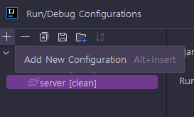
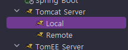
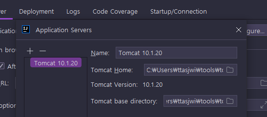
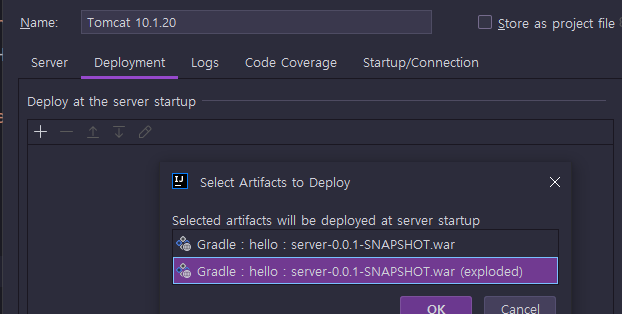
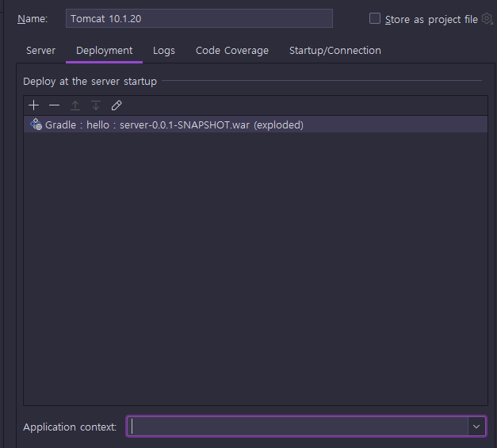
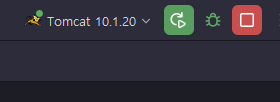

<nav>
    <a href="../.." target="_blank">[Spring Boot]</a>
</nav>

# 2.5 톰캣 설정 - IntelliJ 유료 버전
인텔리J 유료 버전에는 톰캣 지원이 포함되어 있다.

---

## 1. 설정

- 메뉴 Run → Edit Configuration → 왼쪽 상단의 플러스 클릭  

- Other 하위에 있는 Tomcat Server에 Local을 선택한다.
  - 주의! : Tomcat Server 를 선택해야 한다. TomEE Server 를 선택하면 안된다.  

- `Configure…` 부분을 선택한다.
- Tomcat Home: 부분에 설치된 톰캣 폴더를 선택한다.  

- Deployment 메뉴를 선택한다.
- `+` 버튼을 선택한다.
- Artifact… 를 선택
- 끝에 (exploded)로 끝나는 war 파일을 선택한다.  

- Application context 박스 안에 있는 내용을 모두 지워준다.

설정한 톰캣을 선택하고 실행한다.

---

## 2. 실행
- http://localhost:8080
- http://localhost:8080/test
- 주의
  - `java.net.BindException: Address already in use` 오류 메시지가 로그에 보이면 앞서 실행한 톰캣 서버가 이미 8080 포트를 점유하고 있을 가능성이 높다.
  - `shutdown.sh` 를 실행해서 앞서 실행한 톰캣 서버를 내리자 (잘 안되면 컴퓨터를 재부팅 하는 것도 방법이다.)

---
