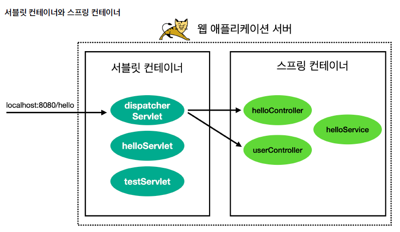
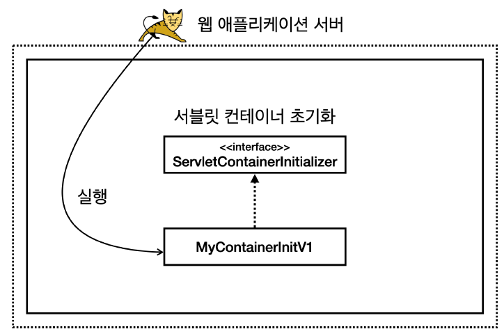

<nav>
    <a href="../.." target="_blank">[Spring Boot]</a>
</nav>

# 2.6 서블릿 컨테이너 초기화 1

## 1. 서블릿 컨테이너와 스프링 컨테이너


- 스프링 MVC에서 학습했 듯, 디스페처 서블릿은 서블릿과 스프링 MVC의 연결고리라 할 수 있다. 서블릿 컨테이너에 위치해있으면서 스프링 컨테이너를 알고 있다. 클라이언트로부터 받은 요청은 디스패처 서블릿을 거쳐서 스프링 컨테이너에 위치한
컨트롤러에게 포워딩된다. 
- 그렇다면 이 디스패처 서블릿은 어떤 과정을 거쳐서 서블릿 컨테이너에 등록될까?

---

## 2. ServletContainerInitialize : 서블릿 컨테이너 초기화 작업
- WAS를 실행하는 시점에 필요한 초기화 작업들이 있다. 서비스에 필요한 필터와 서블릿을 등록하고, 여기에 스프링을 사용한다면 스프링 컨테이너를 만들고, 서블릿과 스프링을 연결하는 디스페처 서블릿도 등록해야 한다.
- WAS가 제공하는 초기화 기능을 사용하면, WAS 실행 시점에 이러한 초기화 과정을 진행할 수 있다.
- 과거에는 `web.xml` 을 사용해서 초기화했지만, 지금은 서블릿 스펙에서 자바 코드를 사용한 초기화도 지원 한다.

```java
public interface ServletContainerInitializer {
    
    void onStartup(Set<Class<?>> c, ServletContext ctx) throws ServletException;
}
```
- 서블릿은 `ServletContainerInitializer` 라는 초기화 인터페이스를 제공한다. 이름 그대로 서블릿 컨테이너를
초기화 하는 기능을 제공한다.
- onStartup
  - 서블릿 컨테이너는 실행 시점에 초기화 메서드인 `onStartup()` 을 호출해준다. 여기서 애플리케이션에 필요한 기능
  들을 초기화 하거나 등록할 수 있다.
  - `Set<Class<?>> c` : 조금 더 유연한 초기화를 기능을 제공한다. `@HandlesTypes` 애노테이션과 함께
  사용한다. 이후에 코드로 설명한다.
  - `ServletContext ctx` : 서블릿 컨테이너 자체의 기능을 제공한다. 이 객체를 통해 필터나 서블릿을 등
  록할 수 있다.

방금 본 서블릿 컨테이너 초기화 인터페이스를 간단히 구현해서 실제 동작하는지 확인해보자.

---

## 3. 실습
### 3.1 MyContainerInitV1
```kotlin
package hello.container

import jakarta.servlet.ServletContainerInitializer
import jakarta.servlet.ServletContext

class MyContainerInitV1 : ServletContainerInitializer {

    override fun onStartup(classes: MutableSet<Class<*>>?, context: ServletContext?) {
        println("MyContainerInitV1.onStartUp")
        println("MyContainerInitV1 classes = $classes")
        println("MyContainerInitV context = $context")
    }
}
```
- 이것이 끝이 아니다. WAS에게 실행할 초기화 클래스를 알려줘야 한다.


### 3.2 WAS에게 초기화 클래스 알리기
```text
hello.container.MyContainerInitV1
```
- `resources/META-INF/services/jakarta.servlet.ServletContainerInitializer` 파일을 생성
- 이 파일에 방금 만든 `MyContainerInitV1` 클래스를 패키지 경로를 포함해서 지정
- **주의!**
  - 경로와 파일 이름을 주의해서 작성해야한다.
  - `META-INF` 는 대문자이다.
  - `services` 는 마지막에 `s` 가 들어간다.
  - 파일 이름은 `jakarta.servlet.ServletContainerInitializer` 이다.


### 3.3 도식화


- 이렇게 하면 WAS를 실행할 때 해당 클래스를 초기화 클래스로 인식하고 로딩 시점에 실행한다.

## 3.4 실행 결과 로그 
WAS를 실행해보자.

```shell
MyContainerInitV1.onStartUp
MyContainerInitV1 classes = null
MyContainerInitV context = org.apache.catalina.core.ApplicationContextFacade@210f8b2b
```
- WAS를 실행할 때 해당 초기화 클래스가 실행된 것을 확인할 수 있다.

---
