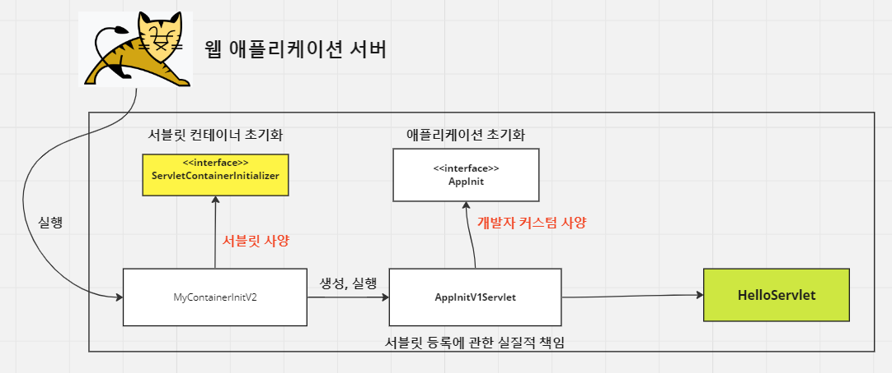

<nav>
    <a href="../.." target="_blank">[Spring Boot]</a>
</nav>

# 2.7 서블릿 컨테이너 초기화 2

---

## 1. 서블릿을 등록하는 두 가지 방법
서브릿을 등록하는 방법은 크게 두 가지 방법이 있다.
- `@WebServlet` 어노테이션 : 서블릿 클래스에 직접 어노테이션을 선언하여 등록하는 방법
- 프로그래밍 방식 : 직접 초기화 클래스를 등록하여 초기화 시점에 코드를 통해 동적으로 등록하는 방법

여기서는 HelloServlet 이라는 서블릿을 서블릿 컨테이너 초기화 시점에 프로그래밍 방식으로 직접 등록해줄 것이다.

---

## 2. HelloServlet 작성
```kotlin
package hello.servlet

import jakarta.servlet.http.HttpServlet
import jakarta.servlet.http.HttpServletRequest
import jakarta.servlet.http.HttpServletResponse

class HelloServlet : HttpServlet() {

    override fun service(req: HttpServletRequest, resp: HttpServletResponse) {
        println("HelloServlet.service")
        resp.writer.println("hello servlet!")
    }
}
```
- 이 서블릿이 실행되면 콘솔에 `"HelloServlet.service"`가 찍히고, HTTP 응답으로 "hello servlet!" 이 온다.

---

## 3. 애플리케이션 초기화
서블릿 컨테이너는 조금 더 유연한 초기화 기능을 지원한다.
강의에서는 이를 애플리케이션 초기화라 방식이라 칭하고 있는데, 이 부분을 이해하려면 실제 동작하는 코드를 봐야한다.

### 3.1 MyContainerInitV2 작성 및 등록
```kotlin
class MyContainerInitV2 : ServletContainerInitializer {

    override fun onStartup(classes: MutableSet<Class<*>>?, context: ServletContext?) {
        println("MyContainerInitV2.onStartUp")
        println("MyContainerInitV2 classes = $classes")
        println("MyContainerInitV2 context = $context")
    }
}
```
```text
hello.container.MyContainerInitV1
hello.container.MyContainerInitV2
```
- 
- `META-INF/services/jakarta.servlet.ServletContainerInitializer` 에 MyContainerV2 를 등록한다.
- 이전 글에서 봤듯 여기까지 하면 초기화 시점에 `hello.container.MyContainerInitV2`의 onStartup 이 실행된다.
- 이제 클래스에서 우리가 작성한 HelloServlet을 추가해줘야한다. 이 클래스에서 직접 등록하는 방법도 있겠지만 이후의 방법을 확인해보자.

### 3.2 AppInit
```kotlin
package hello.container

import jakarta.servlet.ServletContext

interface AppInit {

    fun onStartup(servletContext: ServletContext)
}
```
- 애플리케이션 초기화를 진행하려면 먼저 인터페이스를 만들어야한다. 내용과 형식은 상관없고, 인터페이스는 꼭 필요하다.
- 여기서는 예제 진행을 위해 AppInit 인터페이스를 만든다.
- 인자로 전달된 ServletContext를 제외하면 서블릿 코드가 없다는 것에 집중하자.

### 3.3 AppInitV1Servlet
```kotlin
package hello.container

import hello.servlet.HelloServlet
import jakarta.servlet.ServletContext
import jakarta.servlet.ServletRegistration

class AppInitV1Servlet : AppInit {

    override fun onStartup(servletContext: ServletContext) {
        println("AppInitV1Servlet.onStartup")

        // 순수 서블릿 코드 등록
        val helloServlet: ServletRegistration.Dynamic = servletContext.addServlet("helloServlet", HelloServlet())
        helloServlet.addMapping("/hello-servlet")
    }
}
```
- AppInit 인터페이스의 구현체로 AppInitV1Servlet 을 작성했다.
- 이 클래스는 서블릿 컨텍스트에 HelloServlet 서블릿을 직접 등록한다.
- 이후 HTTP로 `/hello-servlet`을 호출하면 HelloServlet 서블릿이 실행된다.

### 3.4 MyContainerInitV2 에서 AppInit 클래스 구현체들을 가져와서 실행하기
```kotlin
@HandlesTypes(AppInit::class)
class MyContainerInitV2 : ServletContainerInitializer {

    override fun onStartup(classes: MutableSet<Class<*>>?, context: ServletContext?) {
        println("MyContainerInitV2.onStartUp")
        println("MyContainerInitV2 classes = $classes")
        println("MyContainerInitV2 context = $context")

        if (classes == null || context == null) {
            return
        }

        for (appInitClass in classes) {
            try {
                val appInit = appInitClass.getDeclaredConstructor().newInstance() as AppInit
                appInit.onStartup(context)
            } catch (e: Exception) {
                throw RuntimeException(e)
            }
        }
    }
}
```
- MyContainerInitV2 클래스 위에 `@HandleTypes(AppInit::class)` 어노테이션을 연결했다.
- `@HandlerTypes` 어노테이션은 애플리케이션 초기화 인터페이스를 지정할 수 있다. 서블릿 컨테이너 초기화자(ServletContainerInitializer)는
`classes(MutableSet<Classs<*>>?)` 파라미터에 해당 애플리케이션 초기화 인터페이스의 구현체 클래스를 모두 찾아서, 클래스 정보를 목록으로 전달한다.
  - 여기서는 AppInit.class 를 지정했으므로 해당 인터페이스의 구현체인 AppInitV1Servlet.class 정보가 Set에 전달된다.
- 이렇게 가져온 클래스 정보를 기반으로 인스턴스를 생성하고(리플렉션), 해당 인터페이스의 메서드를 실행할 수 있다.
  - 클래스 정보만 전달되므로 객체를 생성해서 사용해야한다.
- `appInit.onStartUp(context)`
  - 애플리케이션 초기화 코드를 직접 실행하면서 서블릿 컨테이너 정보가 담긴 context 도 함께 전달한다.

---

## 4. WAS 실행
### 4.1 실행 로그
```shell
MyContainerInitV1.onStartUp
MyContainerInitV1 classes = null
MyContainerInitV context = org.apache.catalina.core.ApplicationContextFacade@74ada02d
MyContainerInitV2.onStartUp
MyContainerInitV2 classes = [class hello.container.AppInitV1Servlet]
MyContainerInitV2 context = org.apache.catalina.core.ApplicationContextFacade@74ada02d
AppInitV1Servlet.onStartup
```

### 4.2 서블릿 실행
- `http://localhost:8080/hello-servlet`

### 4.3 결과
```text
hello servlet!
```
- HTTP 응답으로 "hello servlet!"이 온다.

---

## 5. 흐름


초기화는 다음 순서로 진행된다.

1. 서블릿 컨테이너 초기화 실행
   - resources/META-INF/services/jakarta.servlet.ServletContainerInitializer 설정에 등록된 ServletContainerInitializer들 실행
2. 애플리케이션 초기화 실행
   - `@HandleTypes(AppInit.class)`

---

## 6. 프로그래밍 방식을 사용하는 이유
```kotlin
@WebServlet(urlPatterns = ["/test"])
class TestServlet : HttpServlet() {
```
- 위와 같이 `@WebServlet`을 사용하면 어노테이션 하나로 서블릿을 편리하게 등록할 수 있다. 하지만 어노테이션을 사용하는 방식은 사용하는 관점에 따라 한계가 존재한다.
    - "/test" 라는 경로가 하드코딩된 것처럼 해당 서블릿에 강하게 결합된다. 이 경로를 변경하려면 해당 서블릿 코드를 직접 변경해야 바꿀 수 있다.
- 반면 프로그래밍 방식은 코드를 더 작성해야하고 불편하지만 아래와 같이 무한한 유연성을 제공한다.
    - 예) "/hello-servlet" 경로를 상황에 따라 바꾸고, 외부 설정을 읽어서 등록할 수 있다.
    - 예) 서블릿 자체도 특정 조건에 따라서, if 문으로 분기해서 등록하거나 뺄 수 있다.
    - 예) 서블릿을 내가 직접 생성하기 때문에 생성자에 필요한 정보를 넘길 수 있다.
---

## 7. 애플리케이션 초기화를 사용하는 이유

### 7.1 편리함
- 서블릿 컨테이너를 초기화하려면 ServletContainerInitializer 인터페이스를 구현한 코드를 만들어야한다.
- 여기에 추가로, jakarta.servlet.ServletContainerInitializer 파일에 해당 코드를 직접 지정해줘야한다.
  - 애플리케이션 초기화는 특정 인터페이스의 구현체만 코드로 작성해주면 된다.

### 7.2 의존성
- 애플리케이션 초기화는 서블릿 컨테이너에 상관 없이 원하는 모양으로 인터페이스를 만들 수 있다.
- 이를 통해 애플리케이션 초기화 코드가 서블릿 컨테이너에 대한 의존성을 줄일 수 있다. 특히 ServletContext가 필요없는 애플리케이션 초기화 코드라면 의존성을 완전히 제거할 수 있다.

---
