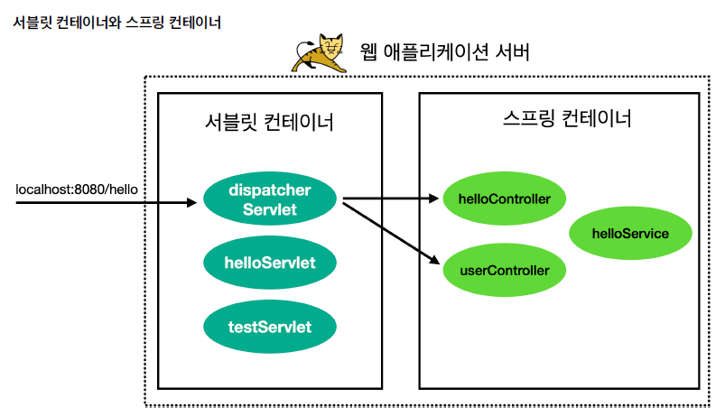

<nav>
    <a href="../.." target="_blank">[Spring Boot]</a>
</nav>

# 2.8 스프링 컨테이너 등록


## 1. 개요 : 서블릿 컨테이너와 스프링 컨테이너


- 이번에는 WAS와 스프링 컨테이너를 통합해보자. 앞에서 배운 서블릿 컨테이너 초기화와 애플리케이션 초기화를 활용하면 된다.
- 다음과 같은 과정이 필요할 것이다.
  - 스프링 컨테이너 만들기
  - 스프링 MVC 컨트롤러를 스프링 컨테이너에 빈으로 등록하기
  - 스프링 MVC를 사용하는데 필요한 디스패처 서블릿을 서블릿 컨테이너에 등록하기

---

## 2. 의존성 추가 -> build.gradle.kts
```kotlin
plugins {
    
    // 추가

    // kotlin-spring allOpen 플러그인
    // 아래 어노테이션이 있을 경우 'open' 키워들을 붙여줌
    // @Component, @Async, @Transactional, @Cacheable, @SpringBootTest, @Configuration, @Controller, @RestController, @Service, @Repository, @Component
    kotlin("plugin.spring") version "1.9.23"
}
```
```kotlin
dependencies {
    // 추가
    
    // 스프링 mvc
    implementation("org.springframework:spring-webmvc:6.1.6")
}
```
- 현재 라이브러리에는 스프링 관련 라이브러리가 없다. 스프링 관련 라이브러리를 추가하자.
- 코틀린의 클래스는 기본적으로 final(상속 불가능) 제어자가 적용되어 있다. 스프링에서는 일부 클래스에 대해 AOP를 적용하는 과정에서 상속 클래스 토대로 프록시를 생성한다.
이 과정에서 충돌이 발생하게 되고, 이를 방지하기 윟애 스프링 사양에 맞는 클래스에 대해 open 키워드를 붙여줘야하는데 이걸 매번 작성하기 번거로우므로 이를 편리하게 할 수 있도록 kotlin("plugin.spring") 를 플러그인을 사용한다.

---

## 3. 컨트롤러 생성 및 컴포넌트 설정 구성

### 3.1 HelloController
```kotlin
package hello.spring

import org.springframework.web.bind.annotation.GetMapping
import org.springframework.web.bind.annotation.RestController

@RestController
class HelloController {

    @GetMapping("/hello-spring")
    fun hello(): String {
        println("HelloController.hello")
        return "hello spring!"
    }
}
```
- HTTP 응답으로 "hello spring!" 을 응답으로 내려주는 간단한 컨트롤러이다.

### 3.2 HelloConfig
```kotlin
package hello.spring

import org.springframework.context.annotation.Bean
import org.springframework.context.annotation.Configuration

@Configuration
class HelloConfig {

    @Bean
    fun helloController(): HelloController {
        return HelloController()
    }
}
```
- 컨트롤러를 스프링 빈으로 직접 등록한다.
- 여기서는 컴포넌트 스캔을 사용하지 않고, 직접 빈을 등록했다.
- 이제 애플리케이션 초기화를 사용해서, 서블릿 컨테이너에 스프링 컨테이너를 생성하고 등록하자.

---

## 4. 애플리케이션 초기화 - 스프링 컨테이너 생성/연결
```kotlin
package hello.container

import hello.spring.HelloConfig
import jakarta.servlet.ServletContext
import jakarta.servlet.ServletRegistration
import org.springframework.web.context.support.AnnotationConfigWebApplicationContext
import org.springframework.web.servlet.DispatcherServlet

/**
 * http://localhost:8080/spring/hello-spring
 */
class AppInitV2Spring : AppInit {

    override fun onStartup(servletContext: ServletContext) {
        println("AppInitV2Spring.onStartup")

        // 스프링 컨테이너 생성 및 설정 클래스 등록
        val appContext = AnnotationConfigWebApplicationContext()
        appContext.register(HelloConfig::class.java)

        // 스프링 MVC 디스패처 서블릿 생성, 스프링 컨테이너 연결
        val dispatcherServlet = DispatcherServlet(appContext)

        // 디스패처 서블릿을 서블릿 컨테이너에 등록 (이름 주의: dispatcherV2)
        val servlet: ServletRegistration.Dynamic = servletContext.addServlet("dispatcherV2", dispatcherServlet)

        // /spring/* 요청이 디스페처 서블릿을 통하도록 설정
        servlet.addMapping("/spring/*")
    }
}
```

### 4.1 스프링 컨테이너 생성
```kotlin
// 스프링 컨테이너 생성 및 설정 클래스 등록
val appContext = AnnotationConfigWebApplicationContext()
appContext.register(HelloConfig::class.java)
```
- `AnnotationConfigWebApplicationContext` 가 바로 스프링 컨테이너이다.
  - `ApplicationContext` 인터페이스를 확장한 클래스로서, 이름 그대로 어노테이션 기반 설정과 웹 기능을 지원하는 스프링 컨테이너로 이해하면 된다.
- `appContext.register(...)` : 컨테이너에 스프링 설정을 추가한다.

### 4.2 스프링 MVC 디스페처 서블릿 생성, 스프링 컨테이너 연결
```kotlin
// 스프링 MVC 디스패처 서블릿 생성, 스프링 컨테이너 연결
val dispatcherServlet = DispatcherServlet(appContext)
```
- 코드를 보면, 스프링 MVC가 제공하는 디스페처 서블릿을 생성하고, 생성자에 앞서 만든 스프링 컨테이너를 전달하는 것을 알 수 있다.
- 이렇게 하면 디스페처 서블릿에 스프링 컨테이너가 연결된다.
- 이 디스페처 서블릿에 HTTP 요청이 오면 디스페처 서블릿은 해당 스프링 컨테이너에 들어있는 컨트롤러 빈들을 호출한다.

### 4.3 디스페처 서블릿을 서블릿 컨테이너에 등록
```kotlin
// 디스패처 서블릿을 서블릿 컨테이너에 등록 (이름 주의: dispatcherV2)
val registration: ServletRegistration.Dynamic = servletContext.addServlet("dispatcherV2", dispatcherServlet)

// /spring/* 요청이 디스페처 서블릿을 통하도록 설정
registration.addMapping("/spring/*")
```
- 디스페처 서블릿을 서블릿 컨테이너에 등록한다.
- `"/spring/*"` 와 같이 경로를 지정하면, `/spring`과 그 하위 요청들은 모두 해당 서블릿으로 통하게 된다.
  - `/spring`
  - `/spring/hello/go`
  - `/spring/hello-spring`
- 주의
  - 서블릿을 등록할 때 이름은 원하는 이름을 등록하면 되지만, 같은 이름으로 중복 등록하면 오류가 발생한다.
  - 여기서는 dispatcherV2 이름을 사용했는데 이후 하나 더 등록할 예정이기 때문에 이름에 유의하자.

---

## 5. 실행

### 5.1 요청
- `http://localhost:8080/spring/hello-spring`

### 5.2 응답
```text
hello spring!
```

---

## 6. 정리

### 6.1 초기화 과정


```shell
MyContainerInitV1.onStartUp
MyContainerInitV1 classes = null
MyContainerInitV1 context = org.apache.catalina.core.ApplicationContextFacade@44ce69ee
MyContainerInitV2.onStartUp
MyContainerInitV2 classes = [class hello.container.AppInitV2Spring, class hello.container.AppInitV1Servlet]
MyContainerInitV2 context = org.apache.catalina.core.ApplicationContextFacade@44ce69ee
AppInitV2Spring.onStartup
AppInitV1Servlet.onStartup
```
- 설정파일에 등록한 ServletContainerInitializer 실행 (서블릿 컨테이너 초기화)
  - MyContainerInitV1 : 서블릿 컨테이너 초기화만 함
  - MyContainerInitV2 : 서블릿 컨테이너 초기화 + 애플리케이션 초기화(AppInit 인터페이스)
    - AppInitV2Spring : 우리가 생성한 스프링 컨테이너를 연결하여, DispatcherServlet 등록
    - AppInitV1Servlet : 우리가 생성한 서블릿을 등록

### 6.2 런타임 과정에서 요청이 컨트롤러로 포워딩 되는 과정
- `/spring/hello-spring`
  - 실행을 `/spring/*` 패턴으로 호출했기 떄문에 다음과 같이 동작함
    - `dispatcherV2` 이름의 디스패처 서블릿이 실행됨(`/spring/*`)
    - `dispatcehrV2` 디스페처 서블릿은 스프링 컨트롤러를 찾아서 실행 (`/hello-spring`)
      - 이 때 서블릿을 찾아서 호출하는데 사용된 `/spring`을 제외한 `/hello-spring` 가 매핑된 컨트롤러(`HelloController`)의 메서드를 찾아서 실행
      - 쉽게 말해서 (`/*`) 부분에서 매칭되는 스프링 컨트롤러를 찾는다.

---
