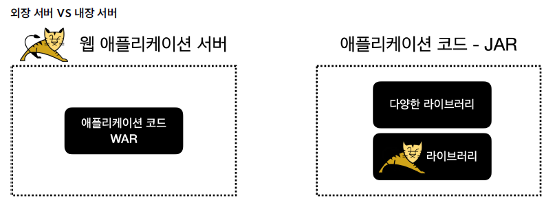

<nav>
    <a href="../.." target="_blank">[Spring Boot]</a>
</nav>

# 3.12 정리

---

## 1. WAR 빌드의 한계


### 1.1 WAR 빌드의 한계
- 톰캣 같은 WAS를 별도로 설치해야 한다.
- 개발 환경 설정이 복잡하다.
    - 단순한 자바라면 별도의 설정을 고민하지 않고, `main()` 메서드만 실행하면 된다.
    - 웹 애플리케이션은 WAS 실행하고 또 WAR와 연동하기 위한 복잡한 설정이 들어간다.
- 배포 과정이 복잡하다. WAR를 만들고 이것을 또 WAS에 전달해서 배포해야 한다.
- 톰캣의 버전을 변경하려면 톰캣을 다시 설치해야 한다.
    - 여러 서버의 톰캣 버전을 변경하려면 모든 서버 각각마다 톰캣을 다시 설치해야한다.

### 1.2 고민
누군가는 오래전부터 이런 방식의 불편함을 고민해왔다.
- 단순히 자바의 `main()` 메서드만 실행하면 웹 서버까지 같이 실행되도록 하면 되지 않을까?
- 톰캣도 자바로 만들어져 있으니 톰캣을 마치 하나의 라이브러리 처럼 포함해서 사용해도 되지 않을까?
- 쉽게 이야기해서 톰캣 같은 웹서버를 라이브러리로 내장해버리는 것이다.
- 이런 문제를 해결하기 위해 톰캣을 라이브러리로 제공하는 내장 톰캣(embed tomcat) 기능을 제공한다.

---

## 2. 내장 톰캣 라이브러리 및 스프링 연결
```kotlin
class EmbedTomcatSpringMain

fun main(args: Array<String>) {
    println("EmbedTomcatSpringMain.main")

    // 내장 톰캣 생성 및 설정
    val tomcat = Tomcat()
    val connector = Connector()
    connector.port = 8080
    tomcat.connector = connector

    // 스프링 컨테이너 생성
    val appContext = AnnotationConfigWebApplicationContext()
    appContext.register(HelloConfig::class.java)

    // 스프링 MVC 디스패처 서블릿 생성, 스프링 컨테이너 연결
    val dispatcherServlet = DispatcherServlet(appContext)

    // 디스패처 서블릿 등록
    val context = tomcat.addContext("", "/")
    tomcat.addServlet("", "dispatcher", dispatcherServlet)
    context.addServletMappingDecoded("/", "dispatcher")

    // 내장톰캣 시작
    tomcat.start()
}
```
- 내장 톰캣 라이브러리를 사용하여, main 메서드 실행 시 톰캣 서버가 실행되도록 한다.
- 내장 톰캣을 사용한 덕분에 IDE에 별도의 복잡한 톰캣 설정 없이 `main()` 메서드만 실행하면
톰캣까지 매우 편리하게 실행되었다.
- 여기에, 스프링 설정을 기반으로 스프링 컨테이너를 생성하여 디스패처 서블릿을 생성하고 연결해주면
컨트롤러를 작성하여 웹 애플리케이션을 개발할 수 있게 됐다.

---

## 3. JAR 빌드
```kotlin
    task(name = "buildJar", type= Jar::class) {
        manifest {
            attributes["Main-Class"] = "hello.embed.EmbedTomcatSpringMainKt"
        }

        from(sourceSets.main.get().output)
    }
```
- 우리의 자바 애플리케이션을 배포하기 위해 JAR를 빌드해야한다.
- 자바의 `main()` 메서드를 실행하기 위해서는 `jar` 형식으로 빌드해야 한다.
- 그리고 `jar` 안에는 `META-INF/MANIFEST.MF` 파일에 실행할 `main()` 메서드의 클래스를 지정해주어야 한다.
- `META-INF/MANIFEST.MF` 파일을 등록해주는 방법도 있지만, gradle의 도움을 받으면 이 과정을 쉽게 진행할 수 있어서 이 방법을 사용했다.
- 하지만 이 방식대로 jar를 빌드하면 실행되지 않는다.
  - 내부 의존 라이브러리들이 함께 빌드되지 않는다.
  - WAR 방식에서는 의존 라이브러리 jar 파일들이 war에 포함되서 빌드되었으나, jar 파일은 내부에 jar를 포함할 수 없다.(java 사양)

---

## 4. FAT JAR 빌드

### 4.1 개요
```kotlin

    task(name = "buildFatJar", type= Jar::class) {
        manifest {
            attributes["Main-Class"] = "hello.embed.EmbedTomcatSpringMainKt"
        }

        from(sourceSets.main.get().output)
        duplicatesStrategy = DuplicatesStrategy.WARN
        from(configurations.runtimeClasspath.get().map { if (it.isDirectory) it else zipTree(it) })
    }
```
- Jar 안에는 Jar를 포함할 수 없다. 하지만 클래스는 얼마든지 포함할 수 있다.
- 라이브러리에 사용되는 `jar` 를 풀면 `class` 들이 나온다. 이 `class` 를 뽑아서 새로 만드는 `jar` 에 포함하는 것이다.
- 이렇게 하면 수 많은 라이브러리에서 나오는 `class` 때문에 뚱뚱한(fat) `jar` 가 탄생한다. 그래서 `Fat Jar` 라고 부르는 것이다.

### 4.2 Far Jar 장점
- Fat Jar 덕분에 하나의 jar 파일에 필요한 라이브러리들을 내장할 수 있게 되었다.
- 내장 톰캣 라이브러리를 jar 내부에 내장할 수 있게 되었다.
- 덕분에 하나의 jar 파일로 배포부터, 웹 서버 설치+실행까지 모든 것을 단순화 할 수 있다.

이전에 살펴보았던 WAR를 외부 서버에 배포하는 방식의 단점을 다시 확인해보자.

### 4.3 WAR 방식 단점 및 해결
- 톰캣 같은 WAS를 별도로 설치해야 한다.
    - 해결: WAS를 별도로 설치하지 않아도 된다. 톰캣 같은 WAS가 라이브러리로 jar 내부에 포함되어 있다.
- 개발 환경 설정이 복잡하다.
    - 단순한 자바라면 별도의 설정을 고민하지 않고, `main()` 메서드만 실행하면 된다.
    - 웹 애플리케이션은 WAS를 연동하기 위한 복잡한 설정이 들어간다.
    - 해결: IDE에 복잡한 WAS 설정이 필요하지 않다. 단순히 `main()` 메서드만 실행하면 된다.
- 배포 과정이 복잡하다. WAR를 만들고 이것을 또 WAS에 전달해서 배포해야 한다.
    - 해결: 배포 과정이 단순하다. JAR를 만들고 이것을 원하는 위치에서 실행만 하면 된다.
- 톰캣의 버전을 업데이트 하려면 톰캣을 다시 설치해야 한다.
    - 해결: gradle에서 내장 톰캣 라이브러리 버전만 변경하고 빌드 후 실행하면 된다.

### 4.4 Fat Jar의 단점(한계)
Fat Jar는 완벽해 보이지만 몇가지 단점을 여전히 포함하고 있다.

- 어떤 라이브러리가 포함되어 있는지 확인하기 어렵다.
    - 모두 `class` 로 풀려있으니 어떤 라이브러리가 사용되고 있는지 추적하기 어렵다.
- 파일명 중복을 해결할 수 없다.
    - 클래스나 리소스 명이 같은 경우 하나를 포기해야 한다. 이것은 심각한 문제를 발생한다.
      예를 들어서 서블릿 컨테이너 초기화에서 학습한 부분을 떠올려 보자.
    - `META-INF/services/jakarta.servlet.ServletContainerInitializer` 이 파일이 여러 라이브러리( `jar` )에 있을 수 있다.
    - `A` 라이브러리와 `B` 라이브러리 둘다 해당 파일을 사용해서 서블릿 컨테이너 초기화를 시도한다. 둘다 해당 파일을 `jar` 안에 포함한다.
    - `Fat Jar` 를 만들면 파일명이 같으므로 `A` , `B` 라이브러리가 둘다 가지고 있는 파일 중에 하나의 파일만 선택된다. 결과적으로 나머지 하나는 포함되지 않으므로 정상 동작하지 않는다.

---

## 5. 스프링 부트 구성
```kotlin
@SpringBootApplication
class BootApplication

fun main(args: Array<String>) {
	runApplication<BootApplication>(*args)
}
```
```kotlin
inline fun <reified T : Any> runApplication(vararg args: String): ConfigurableApplicationContext =
		SpringApplication.run(T::class.java, *args)
```
- 스프링 부트를 실행할 때는 자바 `main()` 메서드에서 `SpringApplication.run()` 을 호출해주면 된
  다.
- 여기에 메인 설정 정보를 넘겨주는데, 보통 `@SpringBootApplication` 애노테이션이 있는 현재 클래
  스를 지정해주면 된다.
- 참고로 현재 클래스에는 `@SpringBootApplication` 어노테이션이 있는데, 이 애노테이션 안에는 컴포
  넌트 스캔을 포함한 여러 기능이 설정되어 있다. 기본 설정은 현재 패키지와 그 하위 패키지 모두를 컴포넌트 스캔
  한다.

이 단순해보이는 코드 한 줄에서 수 많은 일들이 발생하지만, 핵심은 2가지이다.
- 스프링 컨테이너를 생성한다.
- 내장 톰캣(WAS)를 생성하고 그 둘을 연결하는 과정을 진행한다.

---

## 6. 스프링 부트 실행 가능 Jar
- https://docs.spring.io/spring-boot/docs/current/reference/html/executable-jar.html
- 스프링 부트는 Fat Jar가 가진 문제를 해결하기 위해 jar 내부에 jar를 포함할 수 있는 특별한 구조의 jar를 만들고 동시에 만든 jar
  를 내부 jar를 포함해서 실행할 수 있게 했다. 이것을 실행 가능 Jar(Executable Jar)라 한다. 이 실행 가능 Jar를 사용
  하면 다음 문제들을 깔끔하게 해결할 수 있다.
- 문제: 어떤 라이브러리가 포함되어 있는지 확인하기 어렵다.
    - 해결: jar 내부에 jar를 포함하기 때문에 어떤 라이브러리가 포함되어 있는지 쉽게 확인할 수 있다.
- 문제: 파일명 중복을 해결할 수 없다.
    - 해결: jar 내부에 jar를 포함하기 때문에 `a.jar` , `b.jar` 내부에 같은 경로의 파일이 있어도 둘다 인
      식할 수 있다.

참고로 실행 가능 Jar는 자바 표준은 아니고, 스프링 부트에서 새롭게 정의한 것이다.

---
