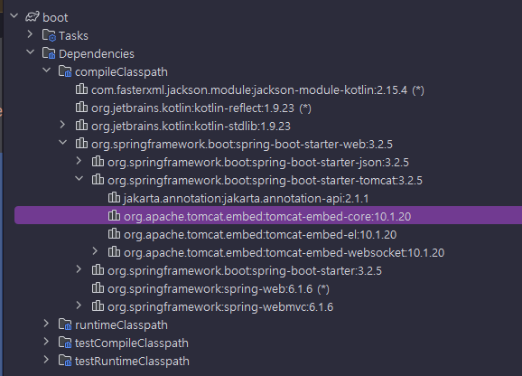

<nav>
    <a href="../.." target="_blank">[Spring Boot]</a>
</nav>

# 3.8 스프링 부트와 웹 서버 - 프로젝트 생성

---

## 1. 스프링 부트
스프링 부트는 지금까지 고민한 문제를 깔끔하게 해결해준다.
- 내장 톰캣을 사용해서 빌드와 배포를 편리하게 한다.
- 빌드시 하나의 Jar를 사용하면서, 동시에 Fat Jar 문제도 해결한다.
- 지금까지 진행한 내장 톰캣 서버를 실행하기 위한 복잡한 과정을 모두 자동으로 처리한다.

스프링 부트로 프로젝트를 만들어보고 스프링 부트가 어떤 식으로 편리한 기능을 제공하는지 하나씩 알아보자.

---

## 2. 프로젝트 생성
- Project: Gradle Project
- Language: Java
- Spring Boot: 3.0.x
- Project Metadata
  - Group: hello
  - Artifact: boot
  - Name: boot
  - Package name: hello.boot
  - Packaging: Jar
  - Java: 17
  - Dependencies: **Spring Web**

---

## 3. build.gradle
```kotlin
import org.jetbrains.kotlin.gradle.tasks.KotlinCompile

plugins {
	id("org.springframework.boot") version "3.2.5"
	id("io.spring.dependency-management") version "1.1.4"
	id("org.jetbrains.kotlin.jvm") version "1.9.23"
	id("org.jetbrains.kotlin.plugin.spring") version "1.9.23"
}

group = "hello"
version = "0.0.1-SNAPSHOT"

java {
	sourceCompatibility = JavaVersion.VERSION_21
}

repositories {
	mavenCentral()
}

dependencies {
	implementation("org.springframework.boot:spring-boot-starter-web")
	implementation("com.fasterxml.jackson.module:jackson-module-kotlin")
	implementation("org.jetbrains.kotlin:kotlin-reflect")
	testImplementation("org.springframework.boot:spring-boot-starter-test")
}

tasks.withType<KotlinCompile> {
	kotlinOptions {
		freeCompilerArgs += "-Xjsr305=strict"
		jvmTarget = "21"
	}
}

tasks.withType<Test> {
	useJUnitPlatform()
}
```

---

## 4. 컨트롤러
```kotlin
@RestController
class HelloController {

    @GetMapping("/hello-spring")
    fun hello(): String {
        println("HelloController.hello")
        return "hello spring!"
    }
}
```

---

## 5. 실행
- `BootApplication.main()`
- `http://localhost:8080/` : White Error 페이지가 뜨면 정상
- `http://localhost:8080/hello-spring`

---

## 6. 내장 톰캣 의존관계 확인


- `spring-boot-starter-web` 를 사용하면 내부에서 내장 톰캣을 사용한다.
- 라이브러리 의존관계를 따라가보면 내장 톰캣( `tomcat-embed-core` )이 포함된 것을 확인할 수 있다.

---

## 7. 라이브러리 버전
```kotlin
dependencies {
	implementation("org.springframework.boot:spring-boot-starter-web")
    testImplementation("org.springframework.boot:spring-boot-starter-test")
}
```
- 스프링 부트를 사용하면 라이브러리 뒤에 버전 정보가 없는 것을 확인할 수 있다.
- 스프링 부트는 현재 부트 버전에 가장 적절한 외부 라이브러리 버전을 자동으로 선택해준다. (이 부분에 대한
자세한 내용은 뒤에서 다룬다.)

---
