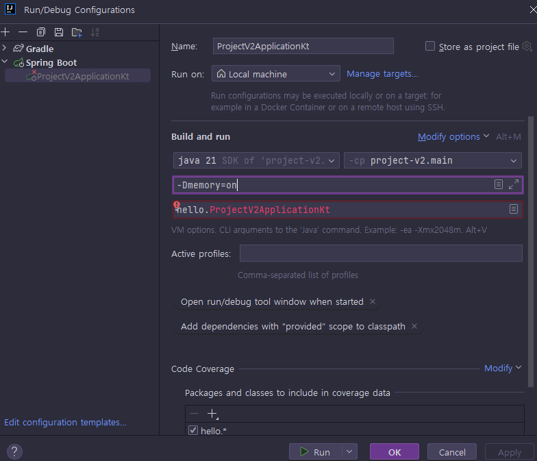

<nav>
    <a href="../.." target="_blank">[Spring Boot]</a>
</nav>

# 5.13 자동 구성 라이브러리 사용하기 2

---

## 1. 라이브러리 추가
- project-v2/libs` 폴더를 생성하자.
- `memory-v2` 프로젝트에서 빌드한 `memory-v2.jar` 를 이곳에 복사하자.
- `project-v2/build.gradle` 에 `memory-v2.jar` 를 추가하자.
    ```kotlin
    dependencies {
        implementation(files("libs/memory-v2.jar")) // 추가
        implementation("org.springframework.boot:spring-boot-starter-web")
        implementation("com.fasterxml.jackson.module:jackson-module-kotlin")
        implementation("org.jetbrains.kotlin:kotlin-reflect")
        testImplementation("org.springframework.boot:spring-boot-starter-test")
    }
    ```
  - 라이브러리를 파일로 직접 가지고 있으면 `files` 로 지정하면 된다.
  - gradle을 리로드하자.

### 주의
- 추가한 폴더 이름이 `lib` 가 아니라 `libs` 인 점을 주의하자!
- 지금처럼 로컬에 파일로 추가한 라이브러리를 IntelliJ가 잘 인식하지 못하는 경우에는 다음과 같이 프로젝트를 다시 임포트 하자.
  - File Open 해당 프로젝트의 `build.gradle` 을 선택하자.
  - 그 다음에 선택창이 뜨는데, Open as Project를 선택한다.

---

## 2. 라이브러리 사용 설정
- 앞서 `project-v1` 에서는 `memory-v1` 을 사용하기 위해 스프링 빈을 직접 등록했다.
- `project-v2` 에서 사용하는 `memory-v2` 라이브러리에는 스프링 부트 자동 구성이 적용되어 있다. 따라
서 빈을 등록하는 별도의 설정을 하지 않아도 된다.
- 다만, `memory-v2` 의 자동 구성에는 다음과 같이 설정했기 때문에 `memory=on` 조건을 만족할 때만 실행된다.
    ```kotlin
    @AutoConfiguration
    @ConditionalOnProperty(name = ["memory"],havingValue = "on")
    open class MemoryAutoConfig {
    ```
- `memory=on` 조건을 주고 실행해보자.  
    
    
    - VM 옵션을 추가하는 경우 `-Dmemory=on` 를 사용해야 한다.

---

## 3. 실행
메모리 조회 기능이 잘 동작하는지 확인해보자.

### 3.1 실행 로그
```shell
MemoryFinder : init memoryFinder
```

### 3.2 엔드포인트 접속
- 접속: http://localhost:8080/memory
- 결과
    ```json
    {
      "used": 26181384,
      "max": 4215275520
    }
    ```
- 메모리 조회 라이브러리가 잘 동작하는 것을 확인할 수 있다.
- `memory=on` 조건을 끄면 라이브러리를 사용하지 않는 것도 확인할 수 있다.

---

## 4. 정리
- 스프링 부트가 제공하는 자동 구성 덕분에 복잡한 빈 등록이나 추가 설정 없이 단순하게 라이브러리의 추가만으로 프로젝트를 편리하게 구성할 수 있다.
- `@ConditionalOnXxx` 덕분에 라이브러리 설정을 유연하게 제공할 수 있다.
- 스프링 부트는 수 많은 자동 구성을 제공한다. 그 덕분에 스프링 라이브러리를 포함해서 수 많은 라이브러리를 편리하게 사용할 수 있다.

---
