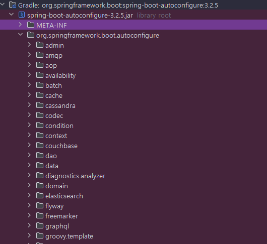

<nav>
    <a href="../.." target="_blank">[Spring Boot]</a>
</nav>

# 5.17 정리

---

## 1. 스프링 부트가 제공하는 자동 구성


- 스프링 부트의 자동 구성(Auto Configuration)은 일반적으로 자주 사용하는 수 많은 빈들을 자동으로 등록해주는 기능이다.
- 예를 들면 `JdbcTemplate` , `DataSource` , `TransactionManager`과 같은 클래스는 데이터베이스 접근을 위해 반복적으로 개발자가 등록해야하는
클래스들인데 스프링 부트는 이러한 자주 사용되는 클래스에 대한 자동 구성을 제공해서 자동으로 스프링 빈으로 등록한다.
- 스프링 부트 프로젝트를 사용하면 `spring-boot-autoconfigure` 라이브러리가 기본적으로 제공되는데, 이 라이브러리에 수 많은 자동구성들이 모여있다.
- 스프링 부트가 제공하는 자동 구성 기능을 이해하려면 다음 두 가지 개념을 이해해야 한다.
  - `@Conditional` : 특정 조건에 맞을 때 설정이 동작하도록 한다.
  - `@AutoConfiguration` : 자동 구성이 어떻게 동작하는지 내부 원리 이해

---

## 2. `@Conditional` 및 그 파생 어노테이션
### 2.1 `@Conditional`
```java
package org.springframework.context.annotation;

@Target({ElementType.TYPE, ElementType.METHOD})
@Retention(RetentionPolicy.RUNTIME)
@Documented
public @interface Conditional {

    Class<? extends Condition>[] value();

}
```
- 개발자가 지정한 모든 조건(Condition)이 일치하는 경우에만 컴포넌트를 빈으로 등록할 수 있음을 나타내는 스프링 어노테이션이다.
    - 스프링 부트 사양이 아니라 스프링 프레임워크 어노테이션이다.
- 참고로 이 기능은 스프링 부트 자동 구성에서 자주 사용한다.

### 2.2 Condition
```java
package org.springframework.context.annotation;

@FunctionalInterface
public interface Condition {
	boolean matches(ConditionContext context, AnnotatedTypeMetadata metadata);
}
```
- `@Conditonal` 어노테이션에 인자로 전달되는 클래스
- matches()` 메서드가 `true` 를 반환하면 조건에 만족해서 동작하고, `false` 를 반환하면 동작하지 않는다.
- `ConditionContext` : 스프링 컨테이너, 환경 정보등을 담고 있다.
- `AnnotatedTypeMetadata` : 애노테이션 메타 정보를 담고 있다.

### 2.3 스프링이 제공하는 다양한 파생 인터페이스 : `@ConditionalOnXxx`
- 스프링 부트는 이미 필요한 대부분의 Condition 구현체 및 `@Conditional`의 파생 어노테이션들을 만들어두었다.( `@ConditionalOnXxx`)
- `ConditionalOnXxx` 공식 메뉴얼 : https://docs.spring.io/spring-boot/docs/current/reference/html/features.html#features.developing-auto-configuration.condition-annotations
  - 이름이 직관적이어서 바로 이해가 될 것이다. `@ConditionalOnXxx` 는 주로 스프링 부트 자동 구성에 사용된다.
- 이런 어노테이션들은 자동 구성에서 많이 사용된다.
- 다음 자동 구성 클래스들을 열어서 소스 코드를 확인해보면 `@ConditionalOnXxx` 가 아주 많이 사용되는 것을 확인할 수 있다.
    - `JdbcTemplateAutoConfiguration` , `DataSourceTransactionManagerAutoConfiguration` , `DataSourceAutoConfiguration`
- `@ConditionalOnXxx`는 스프링 부트에서 제공되는 어노테이션이다.
    - `@Conditional` 자체는 스프링 부트가 아니라 스프링 프레임워크의 기능이다.
    - 스프링 부트는 이 기능을 확장해서 `@ConditionalOnXxx` 를 제공한다.
- 예시
  - `@ConditionalOnClass` , `@ConditionalOnMissingClass`
      - 클래스가 있는 경우 동작한다. 나머지는 그 반대
  - `@ConditionalOnBean` , `@ConditionalOnMissingBean`
      - 빈이 등록되어 있는 경우 동작한다. 나머지는 그 반대
  - `@ConditionalOnProperty`
      - 환경 정보가 있는 경우 동작한다.
  - `@ConditionalOnResource`
      - 리소스가 있는 경우 동작한다.
  - `@ConditionalOnWebApplication` , `@ConditionalOnNotWebApplication`
      - 웹 애플리케이션인 경우 동작한다.
  - `@ConditionalOnExpression`
      - SpEL 표현식에 만족하는 경우 동작한다.

---

## 3. 자동 구성 라이브러리 개발 및 사용

### 3.1 자동구성을 사용하지 않은 라이브러리의 불편함
- 어떤 라이브러리를 사용하는 클라이언트 개발자 입장을 생각해보면, 라이브러리 내부에 있는
어떤 빈을 등록해야하는지 알아야 하고, 그것을 또 하나하나 빈으로 등록해야 한다.
- 간단한 라이브러리가 아니라 초기 설정이 복잡하다면 사용자 입장에서는 상당히 귀찮은 작업이 될 수 있다.
- 프로젝트에 라이브러리를 추가만 하면 모든 구성이 자동으로 구성되도록 처리해주는 것이 바로 스프링 부트 자동 구성(Auto Configuration)이다.

### 3.2 자동 구성 클래스 선언
```kotlin
@AutoConfiguration
@ConditionalOnProperty(name = ["memory"],havingValue = "on")
open class MemoryAutoConfig {
}
```
- `@AutoConfiguration`: 스프링 부트가 제공하는 자동 구성 기능을 적용할 때 사용하는 어노테이션이다.

### 3.3 자동구성 대상 지정
- 스프링 부트 자동 구성을 적용하려면, 다음 파일에 자동 구성 대상을 꼭 지정해주어야 한다.
- 폴더 위치와 파일 이름이 길기 때문에 주의하자.
- 설정
    - 파일 생성: `src/main/resources/META-INF/spring/org.springframework.boot.autoconfigure.AutoConfiguration.imports`
    - **org.springframework.boot.autoconfigure.AutoConfiguration.imports**
      ```text
      memory.MemoryAutoConfig
      ```
    - 앞서 만든 자동 구성인 `memory.MemoryAutoConfig` 를 패키지를 포함해서 지정해준다.
- 스프링 부트는 시작 시점에 `org.springframework.boot.autoconfigure.AutoConfiguration.imports` 의 정보를 읽어서 자동 구성으로 사용한다. 따라서 내부에 있는 `MemoryAutoConfig` 가 자동으로 실행된다.

### 3.4 사용
- 스프링 부트를 사용한다면, 자동구성이 포함된 라이브러리 사용 시 편리하게 해당 라이브러리에서 자동구성 설정한
스프링 빈을 사용할 수 있게 된다.


---

## 4. 스프링 부트 자동 구성의 동작 원리

### 4.1 `@Import` 및 ImportSelector
- 다른 스프링 설정 클래스(`@Configuration` 설정) 정보를 추가하기 위한 어노테이션
- Import 방법
    - 정적인 방법: `@Import(클래스)`
        - 이것은 정적이다. 코드에 대상이 딱 박혀 있다.
        - 설정으로 사용할 대상을 동적으로 변경할 수 없다.
    - 동적인 방법: `@Import(ImportSelector)`
        - 코드로 프로그래밍해서 설정으로 사용할 대상을 동적으로 선택할 수 있다.
- `ImportSelector` 인터페이스를 구현하여 설정으로 사용할 대상을 동적으로 선택할 수 있게 한다.
- `ImportSelector` 를 이해하면 다음 코드를 이해할 수 있다.

### 4.2 `@EnableAutoConfiguration`
```java
@AutoConfigurationPackage
@Import(AutoConfigurationImportSelector.class)
public @interface EnableAutoConfiguration {…}
```
- `AutoConfigurationImportSelector` 는 `ImportSelector` 의 구현체이다. 따라서 설정 정보를 동적으로 선택할 수 있다.
- 실제로 `AutoConfigurationImportSelector` 코드는 모든 라이브러리에 있는 다음 경로의 파일을 확인하고 가져오게 한다.
    - `META-INF/spring/org.springframework.boot.autoconfigure.AutoConfiguration.imports`

### 4.3 스프링 부트 자동 구성이 동작하는 방식
- 스프링 부트 자동 구성이 동작하는 방식은 다음 순서로 확인할 수 있다.
- `@SpringBootApplication` -> `@EnableAutoConfiguration` -> `@Import(AutoConfigurationImportSelector.class)` ->
  `resources/META-INF/spring/org.springframework.boot.autoconfigure.AutoConfiguration.imports` 파일을 열어서 설정 정보 선택 -> 해당 파일의 설정 정보가 스프링 컨테이너에 등록되고 사용

---


---

## 5. 스프링 부트 자동 구성 사용 시 주의사항
- 순서 지정 가능
    ```java
    @AutoConfiguration(after = { HibernateJpaAutoConfiguration.class, TaskExecutionAutoConfiguration.class })
    ```
- 일반 스프링 빈과 라이프사이클이 다르기 때문에 컴포넌트 스캔의 대상이 되면 안되고, 파일에 지정해서 사용해야 한다.
  - 파일: `resources/META-INF/spring/org.springframework.boot.autoconfigure.AutoConfiguration.imports`
  - 스프링 부트가 제공하는 컴포넌트 스캔에서는 `@AutoConfiguration` 을 제외하는 `AutoConfigurationExcludeFilter` 필터가 포함되어 있다.
- 자동 구성이 컴포넌트 스캔을 사용하지 않도록 할 것. 대신에 자동 구성 내부에서 `@Import` 는 사용할 수 있다.

---

## 6. 자동구성을 왜 학습해야하는가?
- `AutoConfiguration` 은 라이브러리를 만들어서 제공할 때 사용하고, 그 외에는 사용하는 일이 거의 없다.
  왜냐하면 보통 필요한 빈들을 컴포넌트 스캔하거나 직접 등록하기 때문이다.
- 하지만 라이브러리를 만들어서 제공할 때는 자동 구성이 유용하다. 실제로 다양한 외부 라이브러리들이 자동 구성을 함께 제공한다.
  보통 이미 만들어진 라이브러리를 가져다 사용하지, 반대로 라이브러리를 만들어서 제공하는 경우는 매우 드물다.
- 그럼 자동 구성은 왜 알아두어야 할까? 자동 구성을 알아야 하는 진짜 이유는 개발을 진행 하다보면 사용하는 특정 빈들이 어떻게 등록된 것인지 확
  인이 필요할 때가 있다. 이럴 때 스프링 부트의 자동 구성 코드를 읽을 수 있어야 한다. 그래야 문제가 발생했을 때 대처가 가능하다.
- 자동화는 매우 편리한 기능이지만 자동화만 믿고 있다가 실무에서 문제가 발생했을 때는 파고 들어가서 문제를 확인하는 정도는 이해해야 한다.
- 이번에 학습한 정도면 자동 구성 코드를 읽는데 큰 어려움은 없을 것이다.

---

## 7. 남은 문제
- 그런데 이런 방식으로 빈이 자동 등록되면, 빈을 등록할 때 사용하는 설정 정보는 어떻게 변경해야 하는지 의문이 들 것이다.
- 예를 들어서 DB 접속 URL, ID, PW 같은 것 말이다. 데이터소스 빈을 등록할 때 이런 정보를 입력해야 하는데, 빈이 자동으로 다 등록이 되어 버린다면 이런 정보를 어떻게 입력할 수 있을까? 
- 다음 장을 통해 알아보자.

---
