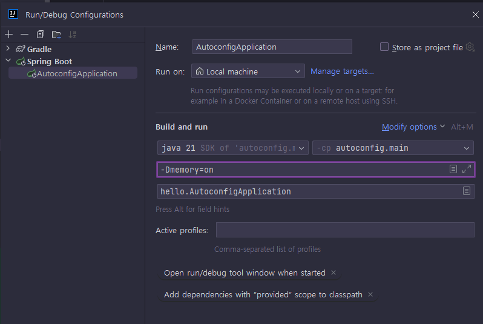

<nav>
    <a href="../.." target="_blank">[Spring Boot]</a>
</nav>

# 5.6 @Conditional

- 앞서 만든 메모리 조회 기능을 항상 사용하는 것이 아니라 특정 조건일 때만 해당 기능이 활성화 되도록 해보자.
- 예를 들어서 개발 서버에서 확인 용도로만 해당 기능을 사용하고, 운영 서버에서는 해당 기능을 사용하지 않는 것이다.
  - 여기서 핵심은 소스코드를 고치지 않고 이런 것이 가능해야 한다는 점이다.
- 프로젝트를 빌드해서 나온 빌드 파일을 개발 서버에도 배포하고, 같은 파일을 운영서버에도 배포해야 한다.

---

## 1. `@Conditional`과 `Condition` 클래스

### 1.1 `@Conditional`
```java
package org.springframework.context.annotation;

@Target({ElementType.TYPE, ElementType.METHOD})
@Retention(RetentionPolicy.RUNTIME)
@Documented
public @interface Conditional {

    Class<? extends Condition>[] value();

}
```
- 개발자가 지정한 모든 조건(Condition)이 일치하는 경우에만 컴포넌트를 빈으로 등록할 수 있음을 나타내는 스프링 어노테이션이다.
  - 스프링 부트 사양이 아니라 스프링 프레임워크 어노테이션이다.
- 참고로 이 기능은 스프링 부트 자동 구성에서 자주 사용한다.

### 1.2 Condition
```java
package org.springframework.context.annotation;

@FunctionalInterface
public interface Condition {
	boolean matches(ConditionContext context, AnnotatedTypeMetadata metadata);
}
```
- `@Conditonal` 어노테이션에 인자로 전달되는 클래스
- matches()` 메서드가 `true` 를 반환하면 조건에 만족해서 동작하고, `false` 를 반환하면 동작하지 않는다.
- `ConditionContext` : 스프링 컨테이너, 환경 정보등을 담고 있다.
- `AnnotatedTypeMetadata` : 애노테이션 메타 정보를 담고 있다.

---

## 2. 커스텀 Condition 작성

### 2.1 요구사항
Condition` 인터페이스를 구현해서 다음과 같이 자바 시스템 속성이 `memory=on` 이라고 되어 있을 때만 메모리 기능이 동작하도록 만들어보자.
```
#VM Options
#java -Dmemory=on -jar project.jar
```

### 2.2 MemoryCondition
```kotlin
class MemoryCondition : Condition {

    private val logger = getLogger(javaClass)


    override fun matches(context: ConditionContext, metadata: AnnotatedTypeMetadata): Boolean {
        val memory: String? = context.environment.getProperty("memory")

        logger.info { "memory = $memory" }

        return "on" == memory
    }

}
```
- 환경 정보에 `memory=on` 이라고 되어 있는 경우에만 `true` 를 반환한다.
  - **참고: 환경 정보와 관련된 부분은 뒤에서 아주 자세히 다룬다.**

### 2.3 MemoryConfig 수정
```kotlin
@Configuration
@Conditional(MemoryCondition::class) // 추가
class MemoryConfig {
```
- `@Conditional(MemoryCondition.class)`
  - 이제 `MemoryConfig` 의 적용 여부는 `@Conditional` 에 지정한 `MemoryCondition` 의 조건에 따라 달라진다.
  - `MemoryCondition` 의 `matches()` 를 실행해보고 그 결과가 `true` 이면 `MemoryConfig` 는 정상 동작한다. 따라서 `memoryController` , `memoryFinder` 가 빈으로 등록된다.
  - `MemoryCondition` 의 실행결과가 `false` 이면 `MemoryConfig` 는 무효화 된다. 그래서 `memoryController` , `memoryFinder` 빈은 등록되지 않는다.

---

## 3. 설정정보 없이 실행

### 3.1 실행
- `http://localhost:8080/memory`

### 3.2 결과
```text
Whitelabel Error Page
This application has no explicit mapping for /error, so you are seeing this as a fallback.

Wed May 01 16:44:25 KST 2024
There was an unexpected error (type=Not Found, status=404).
```
- `memory=on`을 설정하지 않았기 때문에, `MemoryConfig` 클래스의 구성이 포함되지 않는다.


### 3.3 로그 확인
```shell
memory.MemoryCondition                   : memory = null
```
- 로그를 통해서 `MemoryCondition` 조건이 실행된 부분을 확인할 수 있다. 물론 결과는 `false` 를 반환한다.

---

## 4. 설정정보 전달하면서 실행

### 4.1 설정 추가


- 이번에는 `memory=on` 조건을 주고 실행해보자.
- VM 옵션을 추가하는 경우 `-Dmemory=on` 를 사용해야 한다.

### 4.2 실행
```json
{
  "used": 38604464,
  "max": 4215275520
}
```
- `http://localhost:8080/memory`
- `MemoryCondition` 조건이 `true` 를 반환해서 빈이 정상 등록된다.

### 4.3 로그 확인
```shell
memory.MemoryCondition                   : memory = on
memory.MemoryCondition                   : memory = on
memory.MemoryCondition                   : memory = on

memory.MemoryFinder                      : init memoryFinder
```
- 위의 로그를 확인할 수 있다.
- 참고: 스프링이 로딩되는 과정은 복잡해서 `MemoryCondition` 이 여러번 호출될 수 있다. 이 부분은 크게 중요하지 않으니 무시하자.

---

## 5. (참고) 외부 설정
스프링은 외부 설정을 추상화해서 `Environment` 로 통합했다. 그래서 다음과 같은 다양한 외부 환경 설정을 `Environment` 하나로 읽어들일 수 있다. 여기에 대한 더 자세한 내용은 뒤에서 다룬다.


```text
#VM Options
#java -Dmemory=on -jar project.jar
-Dmemory=on
#Program arguments
# -- 가 있으면 스프링이 환경 정보로 사용
#java -jar project.jar --memory=on
--memory=on
#application.properties
#application.properties에 있으면 환경 정보로 사용
memory=on
```

---

