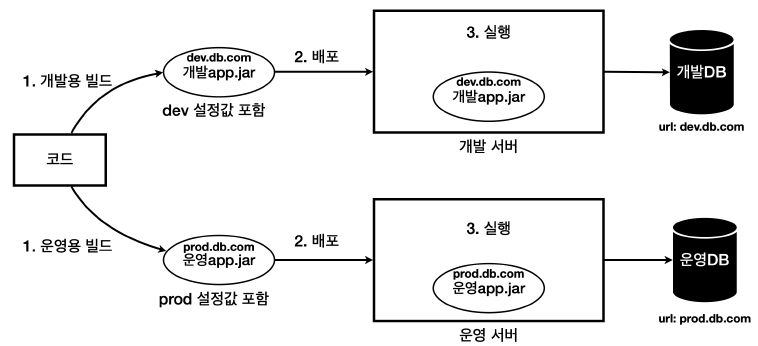
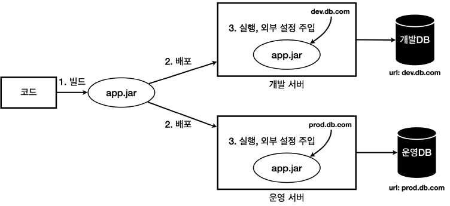
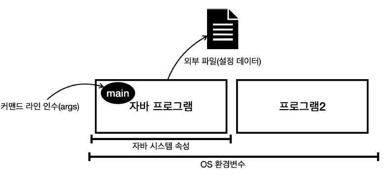

<nav>
    <a href="../.." target="_blank">[Spring Boot]</a>
</nav>

# 6.2 외부 설정이란

---

## 1. 개요
- 하나의 애플리케이션을 여러 다른 환경에서 사용해야 할 때가 있다.
- 대표적으로 개발이 잘 진행되고 있는지 내부에서 확인하는 용도의 개발 환경, 그리고 실제 고객에게 서비스하는 운영 환경이 있다.
  - 개발 환경: 개발 서버, 개발 DB 사용
  - 운영 환경: 운영 서버, 운영 DB 사용
- 문제는 각각의 환경에 따라서 서로 다른 설정값이 존재한다는 점이다. 예를 들어서 애플리케이션이 개발DB에 접근하려
면 `dev.db.com` 이라는 url 정보가 필요한데, 운영DB에 접근하려면 `prod.db.com` 이라는 서로 다른 url을 사용해야 한다.

---

## 2. 환경에 따라 변하는 설정값을 내부에 포함하여 빌드하는 방법
이 문제를 해결하는 가장 단순한 방법은 다음과 같이 각각의 환경에 맞게 애플리케이션을 빌드하는 것이다.

### 2.1 설명
- 개발 환경에는 `dev.db.com` 이 필요하므로 이 값을 애플리케이션 코드에 넣은 다음에 빌드해서 `개발 app.jar` 를 만든다.
- 운영 환경에는 `prod.db.com` 이 필요하므로 이 값을 애플리케이션 코드에 넣은 다음에 빌드해서 `운영 app.jar` 를 만든다.

이렇게 하면 각각의 환경에 맞는 `개발app.jar` , `운영app.jar` 가 만들어지므로 해당 파일들을 각 환경별로 배포하면 된다.

### 2.2 문제점
하지만 이것은 다음과 이유로 좋은 방법이 아니다.
- 환경에 따라서 빌드를 여러번 해야 한다.
- 개발 버전과 운영 버전의 빌드 결과물이 다르다. 따라서 개발 환경에서 검증이 되더라도 운영 환경에서 다른 빌드 결과를 사용하기 때문에
예상치 못한 문제가 발생할 수 있다. 개발용 빌드가 끝나고 검증한 다음에 운영용 빌드를 해야 하는데 그 사이에 누군가 다른 코드를 변경할 수도 있다.
한마디로 진짜 같은 소스코드에서 나온 결과물 인지 검증하기가 어렵다.
- 각 환경에 맞추어 최종 빌드가 되어 나온 빌드 결과물은 다른 환경에서 사용할 수 없어서 유연성이 떨어진다.
향후 다른 환경이 필요하면 그곳에 맞도록 또 빌드를 해야 한다.

---

## 3. 환경에 따라 변하는 설정값을 실행 시점에 주입하는 방법
그래서 보통 다음과 같이 빌드는 한번만 하고 각 환경에 맞추어 **실행 시점에 외부 설정값을 주입**한다.

- 배포 환경과 무관하게 하나의 빌드 결과물을 만든다. 여기서는 `app.jar` 를 빌드한다. 이 안에는 설정값을
두지 않는다.
- 설정값은 실행 시점에 각 환경에 따라 외부에서 주입한다.
  - 개발 서버: `app.jar` 를 실행할 때 `dev.db.com` 값을 외부 설정으로 주입한다.
  - 운영 서버: `app.jar` 를 실행할 때 `prod.db.com` 값을 외부 설정으로 주입한다.
- 이렇게 하면 빌드도 한번만 하면 되고, 개발 버전과 운영 버전의 빌드 결과물이 같기 때문에 개발환경에서 검증되면 운영 환경에서도
믿고 사용할 수 있다. 그리고 이후에 새로운 환경이 추가되어도 별도의 빌드 과정 없이 기존 `app.jar`를 사용해서 손쉽게 새로운 환경을 추가할 수 있다.

### 변하는 것, 변하지 않는 것을 분리하라.
- 유지보수하기 좋은 애플리케이션을 개발하는 단순하면서도 중요한 원칙은 **변하는 것과 변하지 않는 것을 분리**하는 것이
다.
- 각 환경에 따라 변하는 외부 설정값은 분리하고, 변하지 않는 코드와 빌드 결과물은 유지했다. 덕분에 빌드 과정을
줄이고, 환경에 따른 유연성을 확보하게 되었다.

---

## 5. 외부 설정

외부 설정은 일반적으로 다음 4가지 방법이 있다.
- OS 환경 변수: OS에서 지원하는 외부 설정, 해당 OS를 사용하는 모든 프로세스에서 사용
- 자바 시스템 속성(JVM 설정): 자바에서 지원하는 외부 설정, 해당 JVM안에서 사용
- 자바 커맨드 라인 인수: 커맨드 라인에서 전달하는 외부 설정, 실행시 `main(args)` 메서드에서 사용
- 외부 파일(설정 데이터): 프로그램에서 외부 파일을 직접 읽어서 사용
  - 애플리케이션에서 특정 위치의 파일을 읽도록 해둔다. 예) `data/hello.txt`
  - 그리고 각 서버마다 해당 파일안에 다른 설정 정보를 남겨둔다.
    - 개발 서버 `hello.txt` : `url=dev.db.com`
    - 운영 서버 `hello.txt` : `url=prod.db.com`
- 먼저 앞의 3가지를 알아보자. 외부 파일(설정 데이터)은 뒤에서 다룬다.

---

