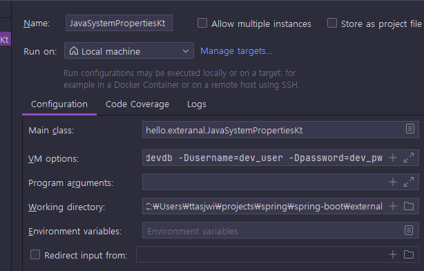

<nav>
    <a href="../.." target="_blank">[Spring Boot]</a>
</nav>

# 6.4 외부 설정 - 자바 시스템 속성

---

## 1. 자바 시스템 속성
- 자바 시스템 속성(Java System properties)은 실행한 JVM 안에서 접근 가능한 외부 설정이다.
- 추가로 자바가 내부에서 미리 설정해두고 사용하는 속성들도 있다.(기본값)
- 자바 시스템 속성은 다음과 같이 자바 프로그램을 실행할 때 사용한다.
- 예) `java -Durl=dev -jar app.jar`
  - `-D` VM 옵션을 통해서 `key=value` 형식을 주면 된다.
  - 이 예제는 `url=dev` 속성이 추가된다. 순서에 주의해야 한다. `-D` 옵션이 - `jar` 보다 앞에 있다.

---

## 2. 실습

### 2.1 실행 코드
```kotlin
package hello.exteranal

fun main() {
    val properties = System.getProperties()
    for (key in properties.keys) {
        println("prop $key = ${properties[key]}")
    }
}
```
- `System.getProperties()` 를 사용하면 `Map` 과 유사한( `Map` 의 자식 타입) `key=value` 형식의 `Properties` 를 받을 수 있다.
이것을 통해서 모든 자바 시스템 속성을 조회할 수 있다.
- `System.getProperty(key)` 를 사용하면 속성값을 조회할 수 있다.

### 2.2 실행 결과
```text
prop java.specification.version = 21
prop sun.cpu.isalist = amd64
prop sun.jnu.encoding = MS949
prop java.class.path = C:\Users\ttasjwi\projects\spring\spring-boot\external\build\classes\kotlin\test;C:\Users\ttasjwi\projects\spring\spring-boot\external\build\classes\kotlin\main;C:\Users\ttasjwi\projects\spring\spring-boot\external\build\resources\main;C:\Users\ttasjwi\.gradle\caches\modules-2\files-2.1\org.jetbrains.kotlin\kotlin-reflect\1.9.24\767f8e3d382a98e2d5a465abe36be2b7019a7be4\kotlin-reflect-1.9.24.jar;C:\Users\ttasjwi\.gradle\caches\modules-2\files-2.1\org.jetbrains.kotlin\kotlin-stdlib\1.9.24\9928532f12c66ad816a625b3f9984f8368ca6d2b\kotlin-stdlib-1.9.24.jar;C:\Users\ttasjwi\.gradle\caches\modules-2\files-2.1\org.springframework.boot\spring-boot-starter-test\3.2.6\56a65212e0f6f050316323e68acba1a2c8aeb85e\spring-boot-starter-test-3.2.6.jar;C:\Users\ttasjwi\.gradle\caches\modules-2\files-2.1\org.springframework.boot\spring-boot-starter\3.2.6\cd5208accde89f97ec11b80db258b043dd71c1f6\spring-boot-starter-3.2.6.jar;C:\Users\ttasjwi\.gradle\caches\modules-2\files-2.1\org.jetbrains\annotations\13.0\919f0dfe192fb4e063e7dacadee7f8bb9a2672a9\annotations-13.0.jar;C:\Users\ttasjwi\.gradle\caches\modules-2\files-2.1\org.springframework.boot\spring-boot-test-autoconfigure\3.2.6\61247ef29fbc2a4e4958796d5e9fc7e72d950aff\spring-boot-test-autoconfigure-3.2.6.jar;C:\Users\ttasjwi\.gradle\caches\modules-2\files-2.1\org.springframework.boot\spring-boot-test\3.2.6\eb19c177af1cac7be7ebf6894f6612d2a855520b\spring-boot-test-3.2.6.jar;C:\Users\ttasjwi\.gradle\caches\modules-2\files-2.1\org.springframework\spring-test\6.1.8\72839d29b5c60e1ce9b720abd6a8c396e5b265b2\spring-test-6.1.8.jar;C:\Users\ttasjwi\.gradle\caches\modules-2\files-2.1\org.springframework\spring-core\6.1.8\141fc11a5dbaa503fe361150312ad0fa9d9c03da\spring-core-6.1.8.jar;C:\Users\ttasjwi\.gradle\caches\modules-2\files-2.1\com.jayway.jsonpath\json-path\2.9.0\37fe2217f577b0b68b18e62c4d17a8858ecf9b69\json-path-2.9.0.jar;C:\Users\ttasjwi\.gradle\caches\modules-2\files-2.1\jakarta.xml.bind\jakarta.xml.bind-api\4.0.2\6cd5a999b834b63238005b7144136379dc36cad2\jakarta.xml.bind-api-4.0.2.jar;C:\Users\ttasjwi\.gradle\caches\modules-2\files-2.1\net.minidev\json-smart\2.5.1\4c11d2808d009132dfbbf947ebf37de6bf266c8e\json-smart-2.5.1.jar;C:\Users\ttasjwi\.gradle\caches\modules-2\files-2.1\org.assertj\assertj-core\3.24.2\ebbf338e33f893139459ce5df023115971c2786f\assertj-core-3.24.2.jar;C:\Users\ttasjwi\.gradle\caches\modules-2\files-2.1\org.awaitility\awaitility\4.2.1\e56b600e0b184182ba5b2baccd2bab593a98a624\awaitility-4.2.1.jar;C:\Users\ttasjwi\.gradle\caches\modules-2\files-2.1\org.hamcrest\hamcrest\2.2\1820c0968dba3a11a1b30669bb1f01978a91dedc\hamcrest-2.2.jar;C:\Users\ttasjwi\.gradle\caches\modules-2\files-2.1\org.junit.jupiter\junit-jupiter\5.10.2\831c0b86ddc2ce38391c5b81ea662b0cfdc02cce\junit-jupiter-5.10.2.jar;C:\Users\ttasjwi\.gradle\caches\modules-2\files-2.1\org.mockito\mockito-junit-jupiter\5.7.0\ac2d6a3431747a7986b8f4abef465f72bf3a21ae\mockito-junit-jupiter-5.7.0.jar;C:\Users\ttasjwi\.gradle\caches\modules-2\files-2.1\org.mockito\mockito-core\5.7.0\a1c258331ab91d66863c983aff7136357e9de056\mockito-core-5.7.0.jar;C:\Users\ttasjwi\.gradle\caches\modules-2\files-2.1\org.skyscreamer\jsonassert\1.5.1\6d842d0faf4cf6725c509a5e5347d319ee0431c3\jsonassert-1.5.1.jar;C:\Users\ttasjwi\.gradle\caches\modules-2\files-2.1\org.xmlunit\xmlunit-core\2.9.1\e5833662d9a1279a37da3ef6f62a1da29fcd68c4\xmlunit-core-2.9.1.jar;C:\Users\ttasjwi\.gradle\caches\modules-2\files-2.1\org.springframework.boot\spring-boot-autoconfigure\3.2.6\14ba3acd4c71f83011d96acbe2513ec2cce3e7a8\spring-boot-autoconfigure-3.2.6.jar;C:\Users\ttasjwi\.gradle\caches\modules-2\files-2.1\org.springframework.boot\spring-boot\3.2.6\9d6cf54cd3076f1b8b1426bd3a98bdcdea1f3149\spring-boot-3.2.6.jar;C:\Users\ttasjwi\.gradle\caches\modules-2\files-2.1\org.springframework.boot\spring-boot-starter-logging\3.2.6\dd38ebe2c6e252408bbbc562eacca08b79823201\spring-boot-starter-logging-3.2.6.jar;C:\Users\ttasjwi\.gradle\caches\modules-2\files-2.1\jakarta.annotation\jakarta.annotation-api\2.1.1\48b9bda22b091b1f48b13af03fe36db3be6e1ae3\jakarta.annotation-api-2.1.1.jar;C:\Users\ttasjwi\.gradle\caches\modules-2\files-2.1\org.yaml\snakeyaml\2.2\3af797a25458550a16bf89acc8e4ab2b7f2bfce0\snakeyaml-2.2.jar;C:\Users\ttasjwi\.gradle\caches\modules-2\files-2.1\org.springframework\spring-jcl\6.1.8\a545266a6efac9283353a922783a0a06f197ec0\spring-jcl-6.1.8.jar;C:\Users\ttasjwi\.gradle\caches\modules-2\files-2.1\jakarta.activation\jakarta.activation-api\2.1.3\fa165bd70cda600368eee31555222776a46b881f\jakarta.activation-api-2.1.3.jar;C:\Users\ttasjwi\.gradle\caches\modules-2\files-2.1\net.minidev\accessors-smart\2.5.1\19b820261eb2e7de7d5bde11d1c06e4501dd7e5f\accessors-smart-2.5.1.jar;C:\Users\ttasjwi\.gradle\caches\modules-2\files-2.1\net.bytebuddy\byte-buddy\1.14.16\e1b9a06e131b7d5b183c8ccc7c29b9e5a8dba077\byte-buddy-1.14.16.jar;C:\Users\ttasjwi\.gradle\caches\modules-2\files-2.1\org.junit.jupiter\junit-jupiter-params\5.10.2\359132c82a9d3fa87a325db6edd33b5fdc67a3d8\junit-jupiter-params-5.10.2.jar;C:\Users\ttasjwi\.gradle\caches\modules-2\files-2.1\org.junit.jupiter\junit-jupiter-api\5.10.2\fb55d6e2bce173f35fd28422e7975539621055ef\junit-jupiter-api-5.10.2.jar;C:\Users\ttasjwi\.gradle\caches\modules-2\files-2.1\net.bytebuddy\byte-buddy-agent\1.14.16\4a451ee6484abac3a498df0f3b33ed00a6fced4d\byte-buddy-agent-1.14.16.jar;C:\Users\ttasjwi\.gradle\caches\modules-2\files-2.1\com.vaadin.external.google\android-json\0.0.20131108.vaadin1\fa26d351fe62a6a17f5cda1287c1c6110dec413f\android-json-0.0.20131108.vaadin1.jar;C:\Users\ttasjwi\.gradle\caches\modules-2\files-2.1\org.springframework\spring-context\6.1.8\21219a0df58e5b96ef489a172b449232573352e8\spring-context-6.1.8.jar;C:\Users\ttasjwi\.gradle\caches\modules-2\files-2.1\ch.qos.logback\logback-classic\1.4.14\d98bc162275134cdf1518774da4a2a17ef6fb94d\logback-classic-1.4.14.jar;C:\Users\ttasjwi\.gradle\caches\modules-2\files-2.1\org.apache.logging.log4j\log4j-to-slf4j\2.21.1\d77b2ba81711ed596cd797cc2b5b5bd7409d841c\log4j-to-slf4j-2.21.1.jar;C:\Users\ttasjwi\.gradle\caches\modules-2\files-2.1\org.slf4j\jul-to-slf4j\2.0.13\a3bcd9d9dd50c71ce69f06b1fd05e40fdeff6ba5\jul-to-slf4j-2.0.13.jar;C:\Users\ttasjwi\.gradle\caches\modules-2\files-2.1\org.ow2.asm\asm\9.6\aa205cf0a06dbd8e04ece91c0b37c3f5d567546a\asm-9.6.jar;C:\Users\ttasjwi\.gradle\caches\modules-2\files-2.1\org.apiguardian\apiguardian-api\1.1.2\a231e0d844d2721b0fa1b238006d15c6ded6842a\apiguardian-api-1.1.2.jar;C:\Users\ttasjwi\.gradle\caches\modules-2\files-2.1\org.junit.platform\junit-platform-commons\1.10.2\3197154a1f0c88da46c47a9ca27611ac7ec5d797\junit-platform-commons-1.10.2.jar;C:\Users\ttasjwi\.gradle\caches\modules-2\files-2.1\org.opentest4j\opentest4j\1.3.0\152ea56b3a72f655d4fd677fc0ef2596c3dd5e6e\opentest4j-1.3.0.jar;C:\Users\ttasjwi\.gradle\caches\modules-2\files-2.1\org.springframework\spring-aop\6.1.8\ef793a21e405a88d9d32b92cb459c845ee12b271\spring-aop-6.1.8.jar;C:\Users\ttasjwi\.gradle\caches\modules-2\files-2.1\org.springframework\spring-beans\6.1.8\79a5e45383542ff514b5328fe277410cf4054f3b\spring-beans-6.1.8.jar;C:\Users\ttasjwi\.gradle\caches\modules-2\files-2.1\org.springframework\spring-expression\6.1.8\dcf78ef442c24f32ff8c6a9746e7f5209b330111\spring-expression-6.1.8.jar;C:\Users\ttasjwi\.gradle\caches\modules-2\files-2.1\io.micrometer\micrometer-observation\1.12.6\ec96cbd5bafac7be6f8192b5c3c926930b571b30\micrometer-observation-1.12.6.jar;C:\Users\ttasjwi\.gradle\caches\modules-2\files-2.1\ch.qos.logback\logback-core\1.4.14\4d3c2248219ac0effeb380ed4c5280a80bf395e8\logback-core-1.4.14.jar;C:\Users\ttasjwi\.gradle\caches\modules-2\files-2.1\org.slf4j\slf4j-api\2.0.13\80229737f704b121a318bba5d5deacbcf395bc77\slf4j-api-2.0.13.jar;C:\Users\ttasjwi\.gradle\caches\modules-2\files-2.1\org.apache.logging.log4j\log4j-api\2.21.1\74c65e87b9ce1694a01524e192d7be989ba70486\log4j-api-2.21.1.jar;C:\Users\ttasjwi\.gradle\caches\modules-2\files-2.1\io.micrometer\micrometer-commons\1.12.6\255ebef194f74428cce1a63d107812d97b15b199\micrometer-commons-1.12.6.jar;C:\Users\ttasjwi\.gradle\caches\modules-2\files-2.1\org.junit.platform\junit-platform-launcher\1.10.2\8125dd29e847ca274dd1a7a9ca54859acc284cb3\junit-platform-launcher-1.10.2.jar;C:\Users\ttasjwi\.gradle\caches\modules-2\files-2.1\org.junit.platform\junit-platform-engine\1.10.2\d53bb4e0ce7f211a498705783440614bfaf0df2e\junit-platform-engine-1.10.2.jar;C:\Users\ttasjwi\.gradle\caches\modules-2\files-2.1\org.junit.jupiter\junit-jupiter-engine\5.10.2\f1f8fe97bd58e85569205f071274d459c2c4f8cd\junit-jupiter-engine-5.10.2.jar;C:\Users\ttasjwi\.gradle\caches\modules-2\files-2.1\org.objenesis\objenesis\3.3\1049c09f1de4331e8193e579448d0916d75b7631\objenesis-3.3.jar
prop java.vm.vendor = Oracle Corporation
prop sun.arch.data.model = 64
prop user.variant = 
prop password = dev_pw
prop java.vendor.url = https://java.oracle.com/
prop java.vm.specification.version = 21
...
```
- 자바가 기본으로 제공하는 수 많은 속성들이 추가되어 있는 것을 확인할 수 있다.
- 자바는 내부에서 필요할 때 이런 속성들을 사용하는데, 예를 들어서 `file.encoding=UTF-8` 를 통해서 기본적인 파일 인코딩 정보 등
으로 사용한다.

---

## 3. 커스텀 옵션 전달
- 이번에는 사용자가 직접 정의하는 자바 시스템 속성을 추가해보자.

### 3.1 코드 추가
```kotlin
package hello.exteranal

fun main() {
    val properties = System.getProperties()
    for (key in properties.keys) {
        println("prop $key = ${properties[key]}")
    }
    
    // 추가
    val url = System.getProperty("url")
    val username = System.getProperty("username")
    val password = System.getProperty("password")

    println("url: $url")
    println("username: $username")
    println("password: $password")
}
```
- `url` , `username` , `password` 를 조회하는 코드를 추가하자

### 3.2 실행 설정


- 실행할 때 자바 시스템 속성을 추가해야 한다.  
- 위와 같이 IDE에서 실행 시에 VM 옵션을 통해 추가하면 된다.
  1. Modify options를 선택한다.
  2. Add VM options를 선택한다.
  3. VM options에 다음을 추가한다.
     `-Durl=devdb -Dusername=dev_user -Dpassword=dev_pw`

### 3.3 실행 결과
```text
#추가한 자바 시스템 속성
url=devdb
username=dev_user
password=dev_pw
```
실행해보면 `-D` 옵션을 통해 추가한 자바 시스템 속성들을 확인할 수 있다.

### 3.4 참고) jar 실행
- `jar` 로 빌드되어 있다면 실행시 다음과 같이 자바 시스템 속성을 추가할 수 있다.
- `java -Durl=devdb -Dusername=dev_user -Dpassword=dev_pw -jar app.jar`

---

## 4. 자바 시스템 속성을 자바 코드로 설정하기
```kotlin
System.setProperty("hello_key", "hello_value")
val helloValue = System.getProperty("hello_key")
println("prop hello_key= $helloValue")
println("===")
```
- 자바 시스템 속성은 앞서 본 것 처럼 `-D` 옵션을 통해 실행 시점에 전달하는 것도 가능하고, 다음과 같이 자바 코드 내부
에서 추가하는 것도 가능하다.
- 코드에서 추가하면 이후에 조회시에 값을 조회할 수 있다.
  - 설정: `System.setProperty(propertyName, "propertyValue")`
  - 조회: `System.getProperty(propertyName)`

참고로 이 방식은 코드 안에서 사용하는 것이기 때문에 외부로 설정을 분리하는 효과는 없다.

---
