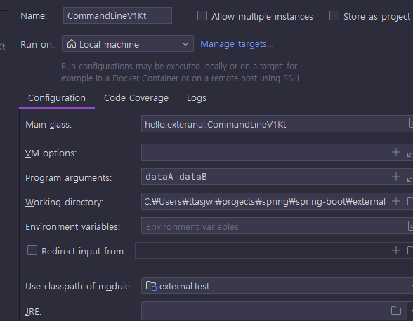

<nav>
    <a href="../.." target="_blank">[Spring Boot]</a>
</nav>

# 6.5 외부 설정 - 커맨드 라인 인수

---

## 1. 커맨드 라인 인수
- 커맨드 라인 인수(Command line arguments)는 애플리케이션 실행 시점에 외부 설정값을 `main(args)` 메서드의
`args` 파라미터로 전달하는 방법이다.
- 다음과 같이 사용한다.
- 예) `java -jar app.jar dataA dataB`
  - 필요한 데이터를 마지막 위치에 스페이스로 구분해서 전달하면 된다.
  - 이 경우 `dataA` , `dataB` 2개의 문자가 `args` 에 전달된다.

---

## 2. 코드에서 사용하기

### 2.1 `src/test` 하위
```kotlin
package hello.exteranal

/**
 * CommandLine 인수는 스페이스로 구분
 * java -jar app.jar dataA dataB -> [dataA, dataB] 2개
 * java -jar app.jar url=devdb -> [url=devdb] 1개
 * url=devdb 이라는 단어를 개발자가 직접 파싱해야 함
 **/
fun main(args: Array<String>) {
    for (arg in args) {
        println("arg $arg")
    }
}
```

### 2.2 IDE에서 실행시 커맨드 라인 인수 추가


- 여기에 `dataA dataB` 를 입력하고 실행하자.
- 커맨드 라인 인수는 공백(space)으로 구분한다.
- 참고: 빨간색으로 칠한 `Program arguments` 가 보이지 않는다면 바로 위에 있는 파란색의 `Modify options` 버튼을 눌러서 추가할 수 있다.

### 2.3 실행 결과
```text
arg dataA
arg dataB
```

### 2.4 jar 실행
- `jar` 로 빌드되어 있다면 실행시 다음과 같이 커맨드 라인 인수를 추가할 수 있다.
- `java -jar project.jar dataA dataB`

---

## 3. `key=value` 형식 입력

### 3.1 `key=value`
- 애플리케이션을 개발할 때는 보통 `key=value` 형식으로 데이터를 받는 것이 편리하다.
- 이번에는 커맨드 라인 인수를 다음과 같이 입력하고 실행해보자
  `url=devdb username=dev_user password=dev_pw`

### 3.2 실행 결과
```text
arg url=devdb
arg username=dev_user
arg password=dev_pw
```


### 3.3 한계
- 실행 결과를 보면 알겠지만 커맨드 라인 인수는 `key=value` 형식이 아니다.
- 단순히 문자를 여러게 입력 받는 형식인 것이다. 그래서 3가지 문자가 입력되었다.
    - `url=devdb`
    - `username=dev_user`
    - `password=dev_pw`
- 이것은 파싱되지 않은, 통 문자이다.
- 이 경우 개발자가 `=` 을 기준으로 직접 데이터를 파싱해서 `key=value` 형식에 맞도록 분리해야 한다.
- 그리고 형식이 배열이기 때문에 루프를 돌면서 원하는 데이터를 찾아야 하는 번거로움도 발생한다.
- 실제 애플리케이션을 개발할 때는 주로 `key=value` 형식을 자주 사용하기 때문에 결국 파싱해서 `Map` 같은 형식으로
변환하도록 직접 개발해야 하는 번거로움이 있다.

---
